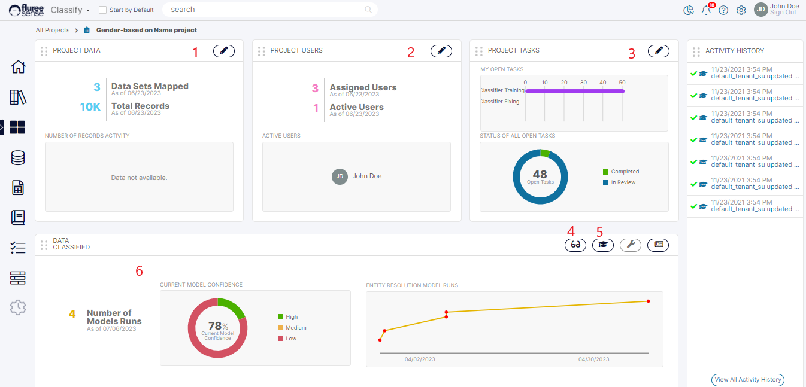
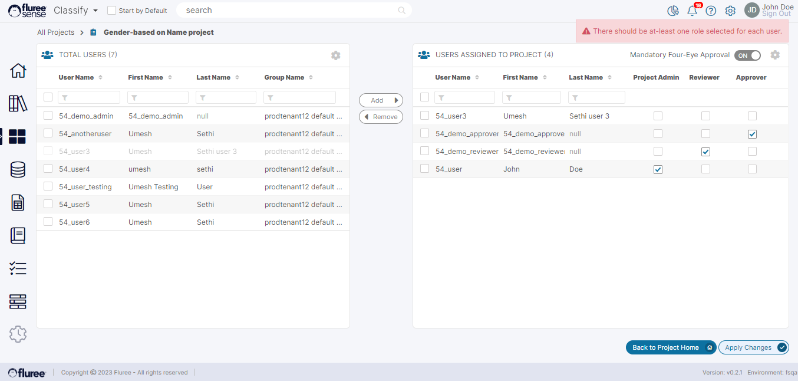

Once we’ve Run the Project, it is sent as a Job to the _Cluster_. It may take up to a minute for the Job to be moved to the processing queue and the progress display to appear on the screen. Once the Job starts, the user can see the progress through various stages of the Classify project through progress-bars, with text information in the result areas.  
  
Let’s understand the various sections of the Home Screen, marked with the serial numbers in the image below.

1. Manage Project Data: Click the icon and use this screen to quickly make changes to Project / Training Data and re-run the model.

3. Manage Project Users: Click the icon and use this screen to quickly make changes to the existing users and their assigned roles in the Project.

5. Manage Project Tasks: Click the icon and use this screen to Re-assign Tasks or even complete them.

7. View Results: Click the icon and use this screen to view all of the classification predictions of the model and even provide feedback.

9. Train Model: Click the icon and use this screen to Train the model with system generated targeted Tasks for maximum accuracy.

11. Classification Summary: This area shows the summary of results, including the current and past model confidence.

Screens 1 to 3 are only available if the logged-on user has _Project Admin_ entitlements; otherwise, the icon is disabled.

**Managing Project Users and Data**

We’ve already seen the Data Screens, such as the Training and the Project Data screens. So, we will not repeat that. But in the case of Managing Project users, let's look at the scenario of adding a new user without specifying the entitlement and pressing “Apply Changes.”

As you can see, you need to specify, at least, one role for any user that you add to the Project.
