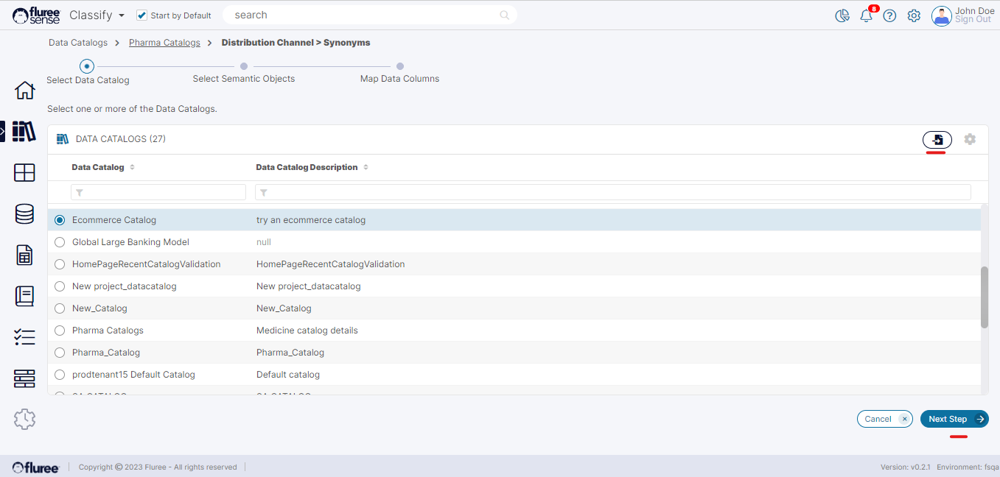
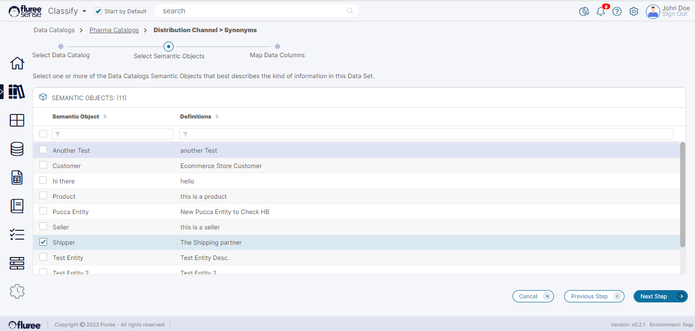
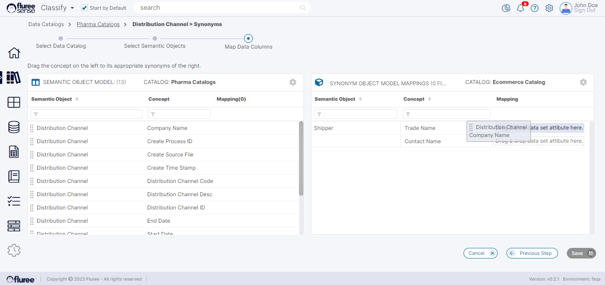

_Synonyms_ can be created by three ways:

1. Manually link one _Concept_ to another _Concept_ from a user interface workflow.

3. Link _Concept_ to other _Concepts_ in Bulk through an import interface.

5. Automatic creation of System Predicted _Synonyms_ after the _Synonym_ Classification Model is run.

Please follow the steps below to create a _Synonym_ manually from workflow:

**Step 1. Click the _Synonym_ icon at _Semantic Object_ or _Concept_ Level.**

Clicking on the _Synonym_ icon opens the workflow. This icon is available both in the list of _Semantic Objects_ as well as in the list of _Concepts_ (when a particular _Semantic Object_ is opened). The only difference is that if we click it from _Semantic Object_, we get the option to provide _Synonyms_ to any of its concepts, whereas if we click it from the _Concept_ level, then we’re in a workflow for that specific _Concept_ only.

In this case, let us do it at the _Semantic Object_ level. The _Semantic Object_ in this case is ‘Distribution Channel’ in ‘Pharma Catalogs’ named Catalog. The aim is to select another Catalog in which there is a _Semantic Object_ that has a _Concept_ that’s similar to a _Concept_ present in the ‘Distribution Channel’ _Semantic Object_ in the Pharma Catalog. Once such a Concept has been found, we can drag the similar _Concept_ from the Distribution Channel _Semantic Object_ and drop it to the newly found _Concept._ Here’s the step-by-step workflow:

**Step 2. Select Semantic Object of Synonym**

In this step, the user needs to select the _Semantic Object_ of the _Synonym Concept._ One key aspect to note here is that while the _Synonym Concept_ may lie in the same Catalog, it cannot be within the same _Semantic Object._  
  
First, the user needs to select a Catalog, based on which the active _Semantic Objects_ of that Catalog will display in the next screen.

In the next screen, the user can select one or more _Semantic Objects_ whose concept he wishes to see on the right side for mapping. In our case, we just selected the _‘Shipper’ Semantic Object_ in Ecommerce Catalog. This can be seen below:

The ‘Next Step’ button is enabled only after, at least, one Object has been selected.  
  
As stated earlier in this step, while Synonyms can be chosen from the same _Catalog_, they cannot be from the same _Semantic Object_. So, if this was the same _Catalog_ as from where we started (i.e. _Pharma Catalog_), then the _Distribution Channel Semantic Object_ would’ve been disabled and unselectable here.

**Step 3. Map Concepts to Synonyms**

Now that we've set up the left and right sides, let us remember that we’re here to find Synonyms for the left side concepts (which are the concepts of the Semantic Object where we triggered this workflow from). To do this, we’ll drag and drop the synonymous concepts from left to right to associate the left concepts with the right Synonyms.  
  
This will look something like below.

Once the user is done with the process, the next step is to just hit **Save**. The _Save_ button will only be enabled if there is, at least, one mapping on the right.  
  
On clicking Save, the user is redirected to the Catalog screen. The _Semantic Object_ from where this workflow started will have its _Synonym_ count increased by number of synonyms across _Concepts_ of that _Object_. Similarly, the _Synonym_ count for each such _Concept_ will also increase in accordance with the number of synonyms associated with it.

Clicking on the _Synonym_ count will show the existing _Synonyms_. In this case, the one you just set up will be shown in a modal window, as can be seen below.

