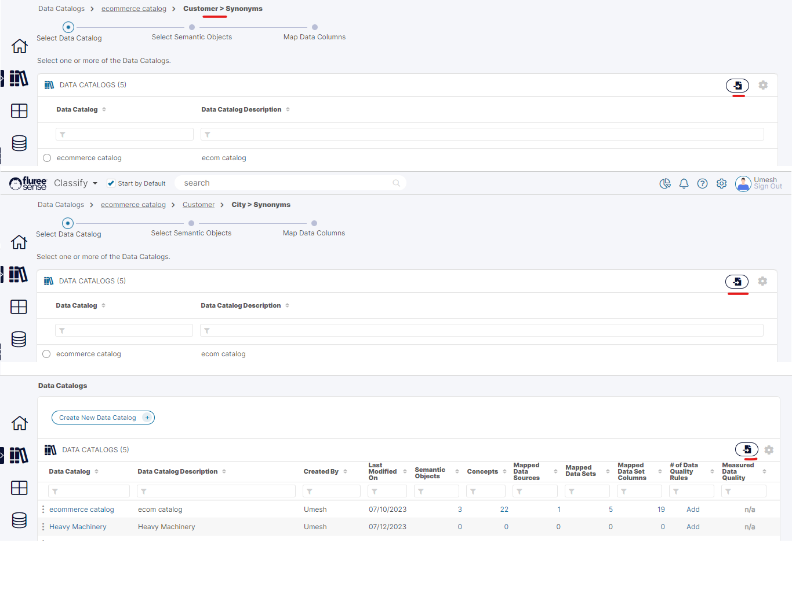
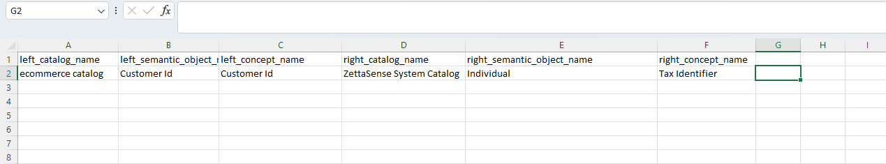
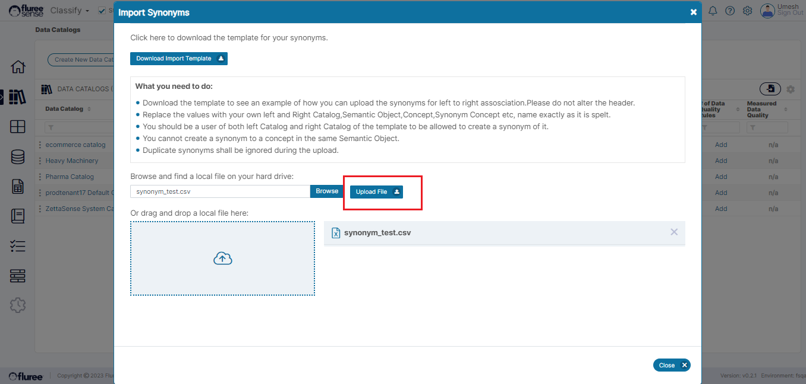
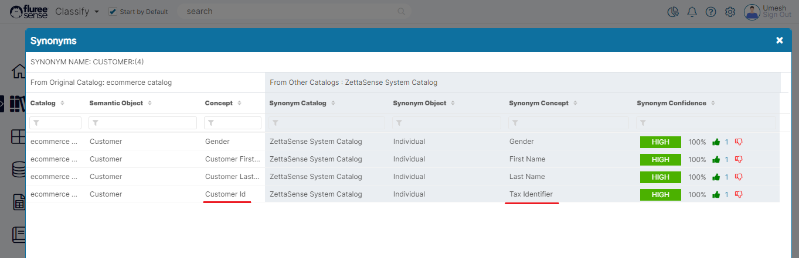

Apart from creating _Synonyms_ through mapping from the user interface, _Synonyms_ can also be imported into the System in bulk. _**Synonyms**_ can be imported from three different screens:

1. First workflow screen for creating _Synonyms_ at Catalog Level for single _Semantic Object_.

3. First workflow screen for creating _Synonyms_ at _Semantic Object_ Level for a single _Concept_.

5. View All Catalogs or the Catalogs List screen.

The below image shows a snapshot of these screens:

To create _Synonyms_ in bulk through import, please follow the steps below:

**Step 1.** Click on the Import _Synonyms_ icon from any of the screens it is available in.  
On clicking the icon, the import popup will open with the details, template download link, and the instructions.

**Step 2.** Download the Template and edit it removing any earlier rows and adding your Data

The _left\_catalog, left\_semantic\_object_ and _left\_concept\_name correspond_ to the Concept for which we want to create a _Synonym._ The _right\_catalog_ and other right-side attributes correspond to the _Synonym_ concept. However, it is to be kept in mind that this is obviously a mirror relationship.

IF ‘A’ is a Synonym of ‘B,’ then ‘B’ is also a Synonym of ‘A,’ hence on opening Synonym Mapping screen from A, you see the mapping from the perspective of A while on clicking ‘B’ you’ll see the mirror image.

Please follow the System validations listed below when adding your Data.

**Step 3.** Upload the Template, check for any errors, and review the results in the Catalog

When you upload the Template:

1. In case ALL the rows have errors, then the error is shown in the popup.

3. In case only some of rows Or None of the rows have errors, the correct mappings are uploaded and the ones failing the validation are ignored. The pop-up will automatically close.

The user should close the pop-up, if not auto closed, and review the results for the appropriate _Concepts_ in their respective _Semantic Objects_. In our case, we just added one _Synonym_ to an existing set of 3 for the _Semantic Object_ \- Customer.

So let’s check the results.

**System Validations**

1. Download the template to see an example of how you can upload the _Synonyms_ for left-to-right association. Please do not alter the header.

3. Replace the values with your own left and right Catalog, _Semantic Object_, _Concept, Synonym Concept_ etc., names exactly as it is spelt.

5. You should be a user of both the left Catalog and right Catalog of the template to be allowed to create a _Synonym_ of it.

7. You cannot create a _Synonym_ for a _Concept_ in the same _Semantic Object_.

9. Duplicate Synonyms shall be ignored during the upload.
