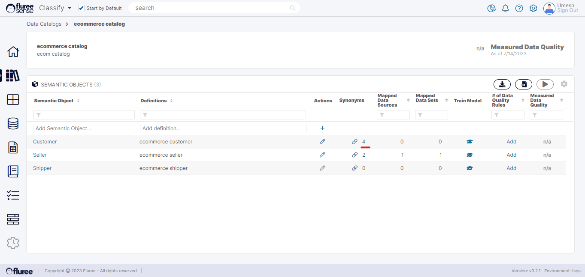
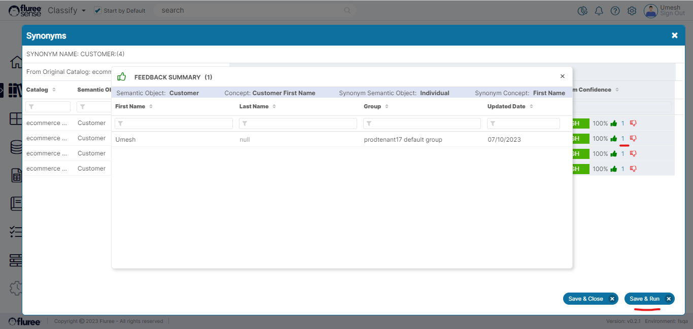

When we talk about Managing _Synonyms_, we’re essentially discussing the ability to provide feedback to _Synonyms_ and Re-run the model. Existing _Synonyms_ can be viewed and accessed to provide feedback by clicking on the _Synonym_ count next to the _Semantic Object_ or _Concept_ for which the _Synonyms_ have been created.  
  
An example can be seen in the image below:

You can give feedback to _Synonyms_ by upvoting or downvoting. A _Synonym’s_ feedback works much in the same way as the _Concept Mapping_ feedback, providing the ability to capture multiple user feedback and generate score on that basis.  
  
Users can provide feedback on all relevant _Synonyms_, which can include manually created as well as predicted _Synonyms_. Therefore, this feedback feature also provides multi-user feedback as in the case of ad-hoc mappings.  
  
Feedback history can be viewed - as in the case of ad-hoc mappings - by clicking on the counts next to the upvotes and downvotes.  

Just as in the case of ad-hoc column mappings for _Concepts_, only distinct latest votes are counted, and the scores are calculated based on distinct latest upvotes over total votes.  
  
There are two options available once you’ve upvoted or downvoted the relevant mappings:

1. **Save & Run:** Saves all mappings and re-runs the _Synonym_ algorithm, which will recalculate and generate new predictions, suppress / remove unnecessary predictions based on the feedback provided till that point of time. This happens across the _Tenant_ and not just for that _Semantic Object_.  
    

3. **Save & Close:** Saves all mapping feedback and redirects to the parent screen.

_Synonym_ predictions are only generated after running the _Synonym_ model at least once.

**Useful Note:** The impact of running this will not just be to generate _Synonym_ predictions, but also to generate column to _Concept_ predictions (ad-hoc mappings) for these concepts.  
  
**Why is that? -** That is because if A is equal to B and if B is tagged to certain columns, it follows that A must also be tagged to these columns. That is, of course, a simplistic statement, but considering multiple aspects, mapping scores etc., additional predictions can be found leading to richer data discovery.
