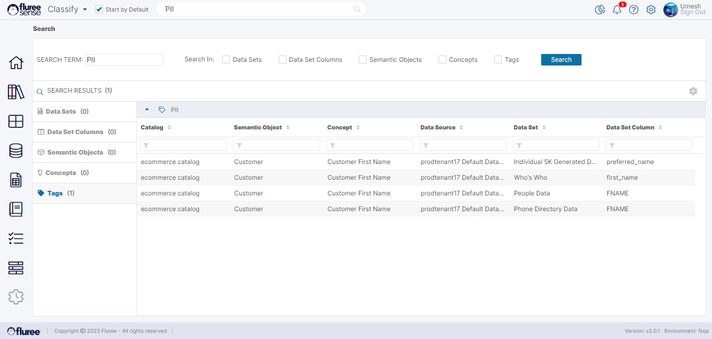

**Searching for a ‘Search’ Term**

_Fluree Sense_ comes with a powerful _Global Search_ feature, which will search against the following objects:

1. Data Sets

3. Data Set Columns

5. Semantic Objects

7. Concepts

9. Tags

Just type the search term in the top search bar to get started. Let’s assume the user has searched for ‘Customer’ here. Note that the Search works on the partial match basis.

Let’s take a moment to understand what is going on in this screen:

1. **Result Listing:** As you can see on the left panel, we have the drill-down tabs to check out the results for each type of object. Clicking on any of the items listed under Matching Term will redirect to its screen.

3. **Refining your search:** On the upper part, you can refine the search by specifying objects that you want to search while leaving other objects deselected.

5. **Search Fields:** In case you noticed, some of the terms do not seem to contain ‘Customer’. This is because the display shows the name of the object, but the search is done both on the Name and Description field.

7. **Tag Search:** Let's look at the tag search quickly in the next image. This is the search for the tags we talked about in the _Catalog_ section.

**Useful Note:** Some of these checkboxes will be disabled in case your _Tenant_ only has the _Resolve_ product licensed, because results for _Semantic Objects, Concepts, Tags_ will have no meaning without _Classify_.
