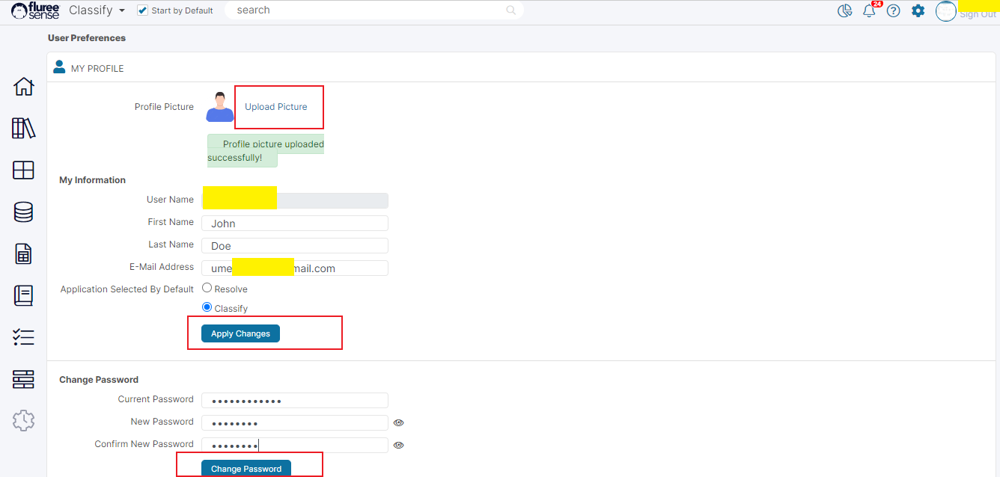
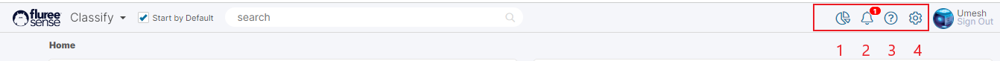

Any user of Fluree Sense can manage their profile through the following Steps after logging in.

In fact, any user has some icons available in the header which can be used for various quick functions:

**Step 1.** Click on the Gear icon (#4) in the header of any screen to open the User Profile screen.

**Step 2.** Edit the Basic Details, Upload Picture or Change Display Name.

As can be seen from the image above, the profile screen has separate sections to upload the display picture, change basic information, such as first and last name and email (not user name). The user is also allowed to specify the module that should load as default on login. The changes are saved by pressing the ‘Apply Changes’ button; only the display image gets updated on ‘Upload Picture’ itself.

**Step 3.** Edit the Password if needed.

The second section allows the user to change the password if they want. The user must enter the New Password, Current Password and Confirm New Password, and then they need to press ‘Apply Changes’ to proceed.

**System Validations**

1. **Password Policy:** To be added.

3. New Password and Current Password cannot be the same.

5. Inputs in the Confirm New Password and the New Password fields should match.

7. For Login: Note that the system requires the user to enter a correct password within 3 tries or it will lock the user out and the Tenant Admin will need to unlock that profile. This can be set differently if required.

9. User Logout On Inactivity: The user remains logged-in unless the token expires after inactivity which can be set to a custom period as per the organization policy.

**Notifications**

For every item which passes through the activity log, Fluree Sense provides System notification, which can be viewed on any screen by clicking the bell icon (marked # 2) available on the header of every screen.

On clicking the icon, a drop-down opens up showing the latest notifications. This is currently a beta feature.

**Help Documentation & Support**

If you’re reading this, you probably already know how to access help documentation 😊 but for the sake of completeness, let us point out details for help documentation and support.

Help documentation is available to anyone with a trial or full version of Fluree Sense. This can be accessed just by clicking on the question mark icon on the header (marked # 3 in the image above), which will lead to a holding screen providing the links or direct access to API and User Help Documentation including this section.

**Consumption Report**

Now, let us look at the final icon (marked # 1) of the controls available in the header to every user. Clicking this icon opens the consumption report which displays:

1. Consumed Records / Data vs. how much is Allocated to you as per your License.

3. Data Quality at the _Tenant_ Level for Source Data

5. Data Quality at the _Tenant_ Level for Target Data.

There isn’t much to explain here except that the boxes at the top are about usage and those at the bottom provide details about source and target Data Quality. The Target Quality section will only start getting updated once there are target records with Data Quality rules applicable on them, such as Golden Records, or Project Published Data Sets.
