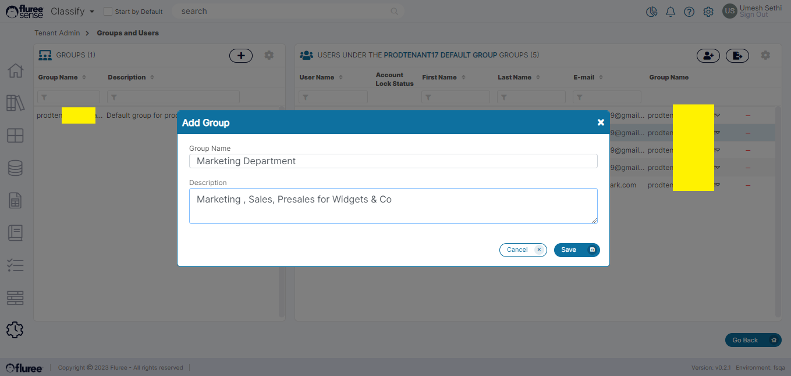
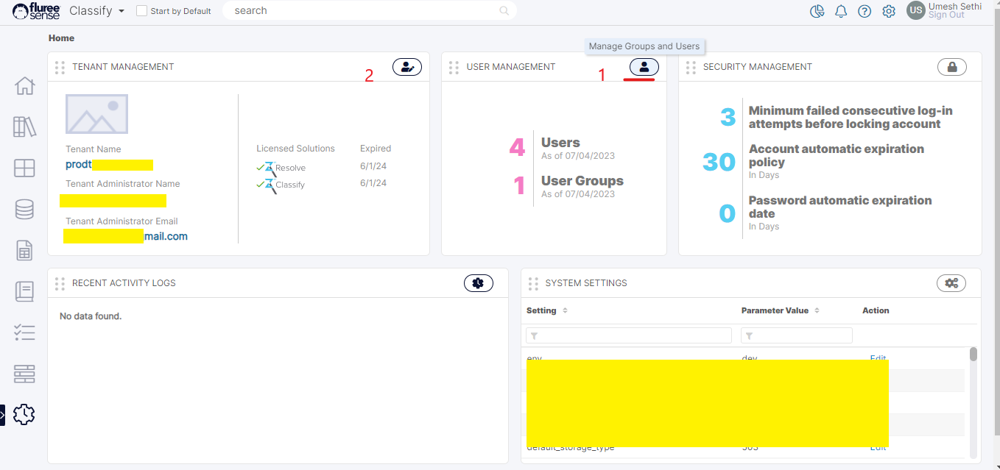
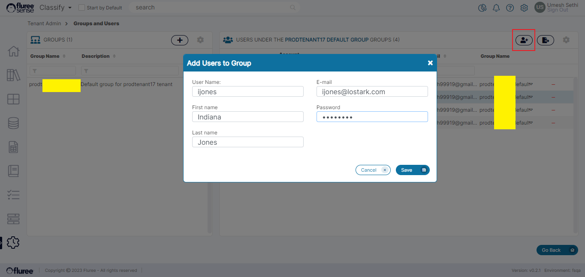
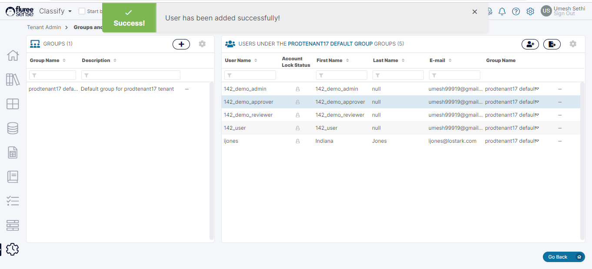
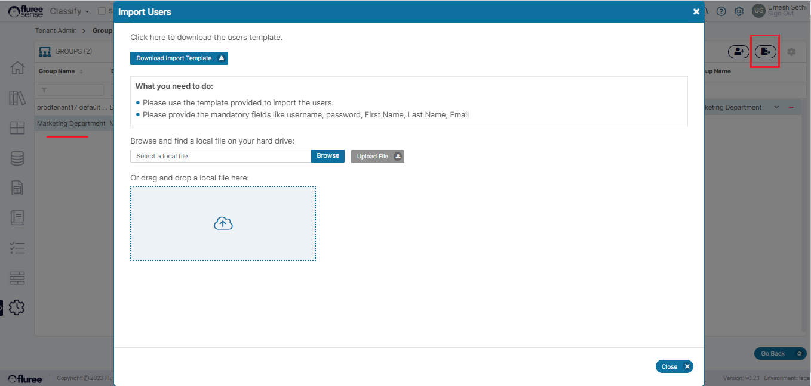
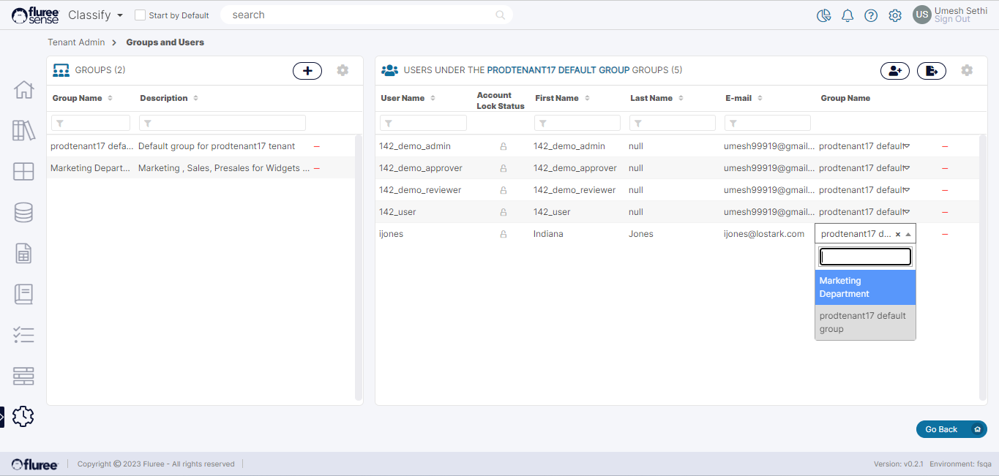

**Types of Users and Roles available**

Let us take a quick look at the types of Users and Roles available in the system. We will not go into feature related roles which we’ll cover when we come to that specific feature such as Catalog, Data Set, Data Source but it is important to make distinction between 3 roles of users initially.

1. System Admin – This role is with Fluree to manage _Tenant_ deployments etc.

3. Tenant Admin – This user role shall manage the _Tenant_, the Users and Groups within the Tenant.

5. Tenant Users – These are all the other users within the _Tenant_. Each Tenant comes with some basic users that are automatically created, which makes it easy to perform various functions associated with the tenant.

**Becoming a Tenant Admin**

**Prerequisite:** The Tenant Admin role has to be created by our system administrator.

A Tenant Admin manages his or her Tenant environment by performing essential functions such as adding Users, Groups and managing them.

Once you sign up with Fluree after the license purchase, our team assists you with the deployment process and creates the first _Tenant Admin_ for your environment based on the details provided. The _Tenant Admin_ can then login, change his or her password and perform the set-up functions for that _Tenant_.

**Adding Groups to your Tenant**

**Prerequisite:** The logged-in user should have the Tenant Admin role.

A newly created tenant comes with a default group but a new group can be added by the _Tenant Admin_.

**Step 1.** Click on the ‘Manage Groups & Users’ icon in the _Tenant Admin Management_ screen.

**Step 2**. Click on the (plus) ‘Add a Group’ icon in the screen which opens up.

You can add the Group name and an optional description. The group name should be unique to the tenant. Click _Save_ to complete, and the group will appear on the left. It will now be available to have users added to it.

**Adding Users to your Tenant (from UI)**

**Prerequisite:** The Logged-in User must have the Tenant Admin Role

Once a _Tenant_ has been created and configured for your organization, the next obvious step is to add users to the _Tenant_. You can add users to the _Tenant_ through the following steps:

**Step 1.** Click on the ‘Manage Groups & Users’ icon in the Tenant Management screen.  
Clicking on the user icon as indicated in the screen below opens up the screen which displays the Groups on the left and the users of that Group on the right panel.

**Useful Note:** When a _Tenant_ is created, you might see several system generated users by default so one should not get alarmed by seeing them in the right panel.

A default group is also visible on the left. Unless a specific group is selected, you will see the default group’s users on the right.

**Step 2.** Select the Group from the left panel to which we want the user to be added.

In the earlier section, we covered how to create new groups. Hence, in the case of multiple groups, the logged-in user needs to select the group from the left panel to which they want to add new users before moving on to Step 3.

**Step 3.** Click on the _Add Users_ icon in the Groups and _Users screen_.  
Clicking on the icon opens the _add user_ popup which contains the following fields and validations.

| **Fields / Inputs** | **Usage / Examples** | **Validation** |
| --- | --- | --- |
| Username | johnwick | Needs to be unique. Mandatory |
| First Name | John | Mandatory |
| Last Name | Wick | Mandatory |
| Email | johnwick@greatmovies.com | Needs to be unique across the tenant \* |
| Password | Provide | Mandatory.   (Strong Password policy: Details to be added.) |

**Useful Note:** The implication of making the email unique across tenants and not across the system is that it still allows users to use the same email for more than 1 tenant BUT the user will ONLY receive notifications on email for the specific tenant where they are triggered.

**Step 4.** Click ‘Save’ to Save the User and review the details on the right.

Voila! Your user should be saved and ready to be used as part of the group for various features of _Classify_ and _Resolve_. We’ll take up individual feature-specific roles in the latter part of the documentation.

**To recap:** Each _Tenant_ comes bundled with a Default group to which all users can be added. You can add more groups and users, and rename the default one as well. It also comes bundled with a Default Data Source, Default Catalog and Default Data Sets, but you can request suppressing the Data Set creation.

**Importing New Users**

A Tenant Admin can import new Users for the Tenant as an alternative to adding them from the user interface one by one. To import new Users, follow the steps below:

1. Click on the Users icon from the Tenant _Admin_ home screen.

3. Click on the ‘Import Users’ icon from the ‘Groups and Users’ screen.

5. Download the Import Template and add new Users.

7. Upload the Template and review the errors / results.

**Managing Users**

A Tenant Admin has the ability to manage users, including removing users from a group, deleting users from a Tenant and changing certain user-details.

1. To move a user to a different group: Simply click on the drop-down as shown in the image below and change the group to the one that is required for that user.

2\. To delete a user: Click on the minus icon next to the user in the right panel.  
Deleting a user is a soft-delete operation and will disallow the user to be able to login.
