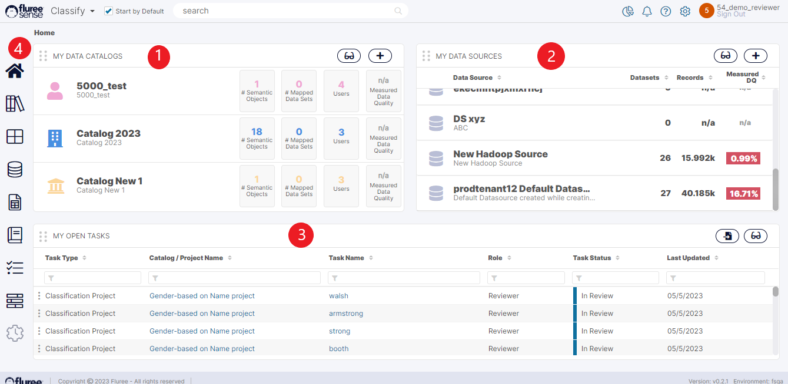

Click the URL to log in to your account and enter the User ID and password as shown below.

You will reach the Home Page. It has four important areas- My Projects, My Data Sources, My Open Tasks, and Navigational Menu.  

1. **My Project:**  
    The last three active Resolve Projects you have worked on will be listed on the panel. You can access the project directly or go to the complete list of Projects to check your entitlement or access rights. 
      
    

2. **My Data Sources:**  
    In this panel, you will see all current systems or data storage platforms that the Resolve module has access to. This is where Resolve sources raw data from and performs de-duplication. The source systems that appear under Data Sources are only the ones that an Administrator has granted you access to. If you do not have access to a specific Data Source, the Source System will not appear in this panel. 
      
    

3. **My Open Tasks:**  
    This panel lists all learning tasks currently assigned to you and awaiting feedback. You can quickly traverse and complete your tasks from this panel. Remember, it is important to complete these tasks to train the model correctly and increase prediction accuracy. 
      
    

4. **Navigational Menu:**  
    Here, you can check for all other system functionalities depicted by icons. Depending on your level of access rights, you may or may not have access to certain system functions. The functionalities that you can check out include the following: 
      
    - List of all **Projects**
    
    - List of all **Data Sources**
  
    - List of all **Data Sets.** In this case, Data Sets represent different files or tables that may be under a Data Source. (Note: A Data Source may have one or more Data Sets within them)
    
    - List of all **Tasks**. This will show all tasks assigned to you OR are part of a project where you are the Project Admin.
    
    - **System Jobs**. 
      This is where you can see system functions that are running. For example, you can see which unsupervised or supervised projects are running.
    
    - **Admin** 
      This is only available if you have Administrator access and it allows you to manage users, and other application-level configurations.

      Click the blue bar next to the home icon to expand the left menu with full title descriptions for each icon.

**Useful Note:** It is important to reset the system-generated Password created with your account. Locate your name at the upper right-hand side of the screen and click on the “Settings” icon to the left of your name to change the Password, including user detail options. Once you have successfully changed your Password, you will be taken back to the Login screen.
