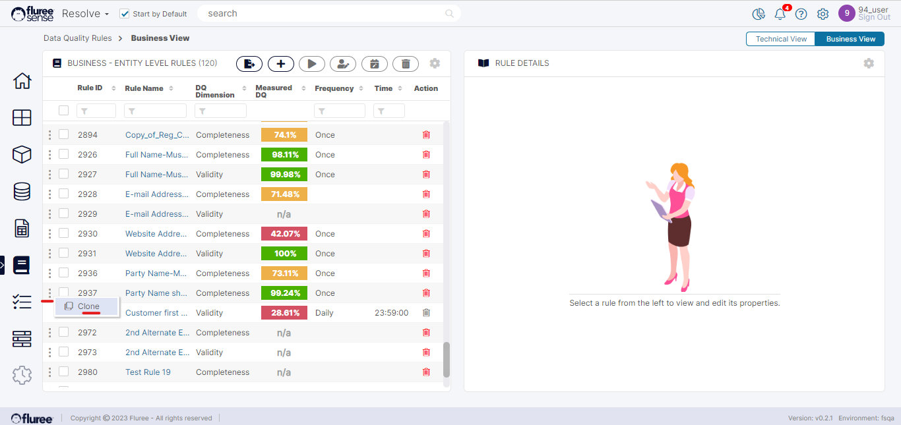

You can clone a _Business or a Technical rule_ from the main grid by clicking on the ‘Clone’ option in the ellipsis menu next to the Id of the Rule.

**System Validations**

1. Only a _Rule Admin_ may clone a Rule. Otherwise, the Clone link is disabled.

3. In _Business Rules_, only non _OOB rules_ can be cloned.

5. The Cloned rule opens the rule workflow and all the validations related to a normal rule being created apply.

7. The schedule and entitlements of the original rule are copied to the new Rule as well.

9. Rules are Cloned immediately on press of the Clone button. If you’ve cloned a rule by mistake, you can always use the delete option.
