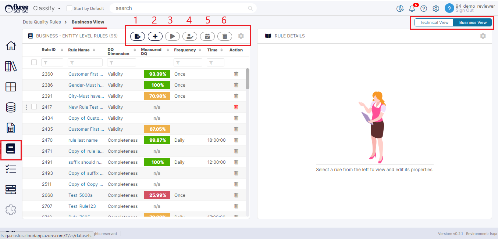

A Data Quality Rule, in simple terms, is a set of predefined rules that we expect the Data to follow and if it doesn’t, then the same needs to be captured as an ‘exception.’ There are 2 types of Rules in the system:

a) **Technical Rule:** This is where we create rules specifically for Dataset/Table columns where we know exactly for which column(s) we want the rule to be followed.  
b) **Business Rule:** This is where we create rules on Concepts or business attributes which are mapped to one or more data set columns.

The system offers two screens or views. One of the two views lists all the Data Quality rules pertaining to the technical rule type. This view is called the _Technical View_. The other view lists all the data quality rules pertaining to the business rule type. This view is called the _Business View_.

Let’s look at the two views one by one, starting with the _Business View._

This view is accessible from the left menu clicking on the Data Quality Tab. The Tab remains disabled if you do not have an active _Data Quality_ Add-on license.  
  
As can be seen on the header, the _Business View_ Tab is active. When we click on the _Technical View_, we can see all the ‘Technical Rules’ of the system as shown below.

In the first image marked with numbers from 1 to 6, we have control icons, which will be available in both main views and some other views. Let us quickly go through these as they will be referred to in latter sections.

**Rule Control Icons**

1. Import Rules

3. Create a Rule

5. Run Multiple Rules

7. Edit Users for Selected Rules

9. Edit Schedules for Selected Rules

11. Delete Rules in Bulk

These are separate topics by themselves; so we’ll cover them in due course. For now, it is sufficient to note that these icons correspond to the named functionality.

Of course, these views are only possible when there are rules existing in the system; so let us start by seeing how we can create some rules.
