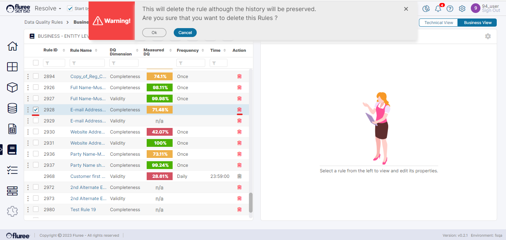
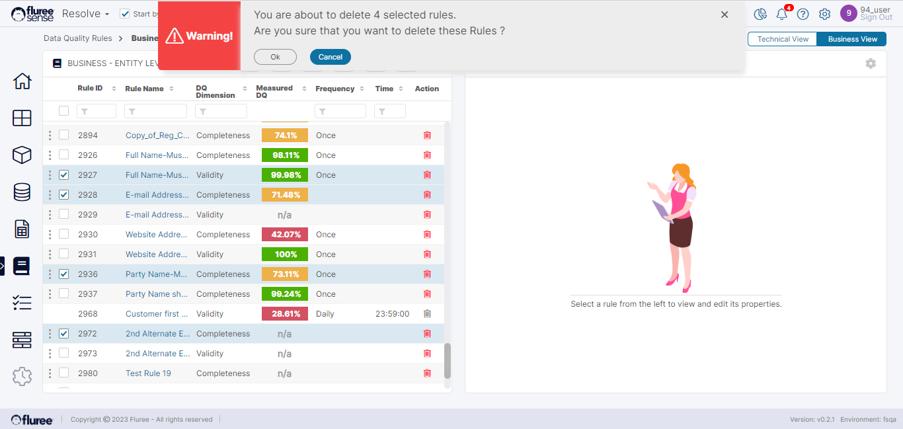

Data Quality rules can be deleted one at a time or in bulk. The logged-on user needs to have the _Rule(s) Admin_ entitlements to delete a rule. A rule, when deleted, immediately disappears from all the grids where it used to appear and is not counted or used for Data Quality processing anymore. Internally, this is implemented as a soft delete.

**Deleting a Single Rule**

To delete a single rule, simply click the Garbage Bin icon in the rule row in the Data Quality Rule grid. This applies to both _Technical_ and _Business rules_. A confirmation top hat notification will be shown before deletion.

**Deleting Rules in Bulk**

To delete multiple rules, simply select the checkboxes in the grid and click on the Delete rule icon on the header of the grid. A confirmation top hat notification will be shown before deletion.

**System Validations**

1. In either case, the rule will disappear from the grid and any relevant view, be soft deleted and will not be used for quality scoring etc.

3. The logged-on user needs to have ‘_Rule Admin_’ entitlement to delete the rules. In case of single rule delete, the garbage icon will be disabled otherwise. In case of multiple rule delete, no checkboxes will be available against those rules where the user is not a ‘Rule Admin’.
