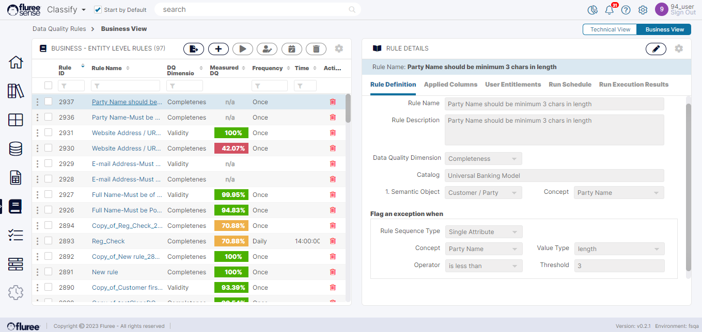

To Edit a rule, you are provided with multiple tabs for easy editing of manageable grouped aspects of the Rule. There is a specific tab for editing the Rule Definition, a tab for editing the Rule Entitlements, and another for editing the Rule Schedule . Additionally, there are tabs to view or provide feedback to the Applied Columns on the Rule and View the Exception of the rule.

If you recall, in an earlier section we had Created a New Business Rule. Now let us look at how the very same rule’s ‘Rule Definition’ can be edited. Rule Definition refers to the operational details of the rule such as Name, Description, Dimension and Exception condition(s). This is true for both types of rules.

To edit a Business or Technical Rule’s Definition:

**Step 1:** Select the Rule from the left panel. The Rule opens on the right with the Rule Definition Tab opened as default.

**Step 2:** Click on the edit icon on the rule header in the right panel – which shall be enabled only if you are the ‘_Rule Admin_’ for the Rule. This can be toggled to open the rule details in Editable / Display mode.

Another important thing to note is that because of their very nature, exception conditions, name etc. of _OOB Business rules_ cannot be edited. They’ll still appear disabled after you click the Edit icon. This is because _OOB rules_ follow specific conventions in naming and what they are used for.

**Step 3:** Edit the Exception conditions, the name, add or remove conditions, Dimensions etc. as required and ‘Save Changes’ to save the rule. Note that the rule will not automatically run just on ‘Save Changes’.

