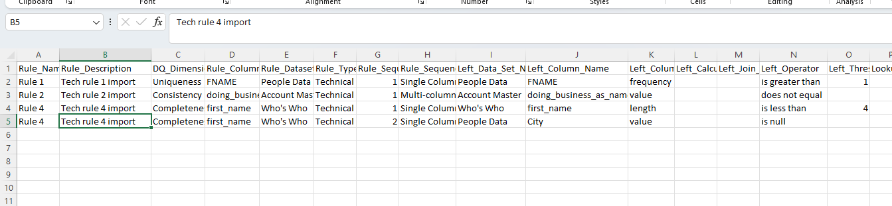
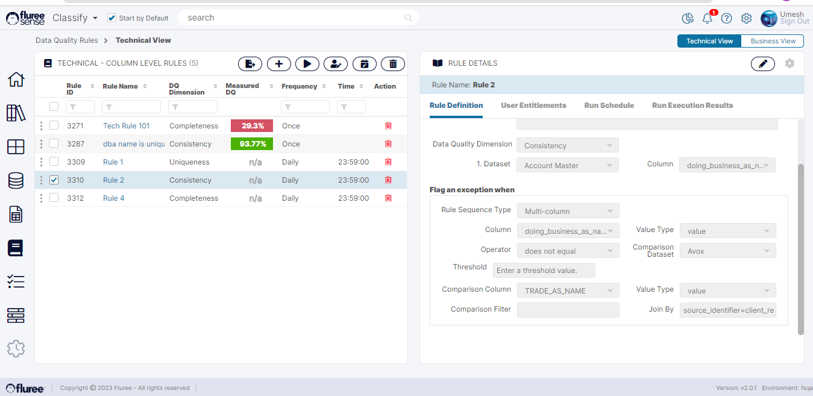
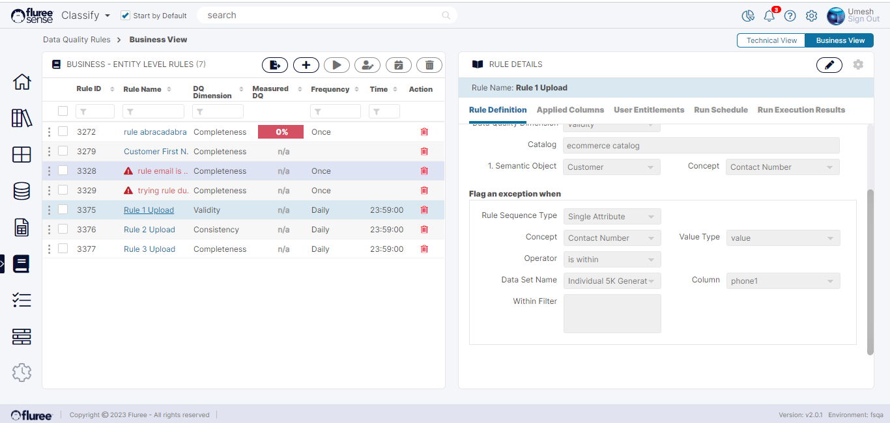

Fluree Sense also provides an interface to create rules quickly and easily in bulk through import. You can import both _Technical_ and _Business_ _rules_ in Bulk.

To Import a set of Business / Technical rules, go to the respective view and:

**Step 1. Click on the ‘Import Rules’ icon & Download the Import Template**

At this point, an import pop-up will open up with the link to the Import Template, Help Text and the Upload input box. Note that the template will automatically be different for Business vs. Technical View – corresponding to the different types of Rules that are to be downloaded.

Therefore, you cannot mix or upload both types of rules in the same template. Download the Template by clicking on the ‘Download Import Template’ button and open it locally.

**Step 2. Edit the Template and add your own Rules**

This is the main step. To help you understand how to create typical rules, we’ve provided some examples below with the corresponding look of how that rule would be in the upload template.

The row extends further:

Notice rule 4 occupying 2 rows and how it is linked through the ‘OR’ operator as a multi-exception rule. Also notice Rule 2 as a complex Multi-column rule where 2 specific Data Columns are compared for a join condition. In the steps below we’ll show how these rules look once imported.

**Step 3. Upload the Template with Changes**

Make changes to the template adding your rule(s). It will be a good idea to upload in batches so as to keep track of any errors in a better and more manageable way. In case of errors: they are generally summarized as per the no. of rules which didn’t get created.

**Step 4. Review the Rule(s) created and visible in the Main View**

We’ll quickly review how Rule 2 and Rule 4 look when opened up in display mode, so that you can see which fields in the CSV ended up where on the screen.

Here’s how Rule 4 looks like in the _Technical_ _View_ screen

And, here’s how Rule 2 looks like:

To recap, using the CSV as per the image above, we were able to create 3 typical types of rule.

1. Technical Rules Single Column with Threshold

3. Technical Rules - Multi-Column - compare columns with a Join condition.

5. Technical Rule with 2 exception conditions

Similarly, we can create many other types of rules by adding the operator, threshold, value type, etc. values in corresponding columns spelt correctly and exactly as appearing in the screen.

**Business Rules Import**

Similarly let us look at 3 Business Rules examples as listed below. We’ll not go through all the steps for the sake of brevity as they are all the same but we’ll just show the image of the CSV and an imported rule, as the template is different.

1. _Business_ _Rule_ – Single Attribute – within condition

3. _Business_ _Rule_ – Multi Attribute

5. _Business_ _Rule_ - Single Attribute with 2 conditions

(The screenshot of the entire row has been split in two halves to let you see clearly.)

Rule 1 corresponds to:

**System Validations**

1. The Rules Import Template has different validations where it essentially ignores uploading a rule which has been incorrectly defined in the template, but imports the correct ones.  
    

3. Rules include names of _Concepts_, _Semantic_ _Objects_, Data Sets, Columns, Operators, Conditions etc. all of which need to be spelt correctly (as shown in the example) for them to be imported successfully.  
    

5. The logged-on user who is importing the rule is defaulted to its Rule Admin. Other users need to be added from the front-end.  
    

7. All fields which are required from the UI side are also required from within the template.
