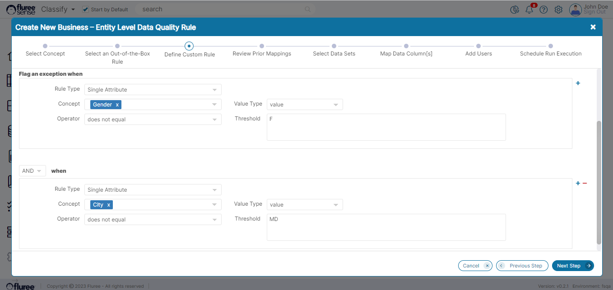
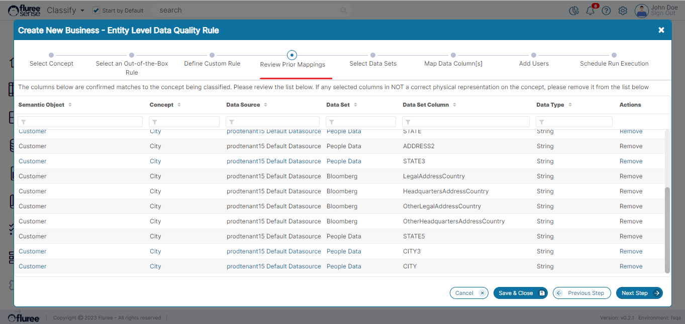
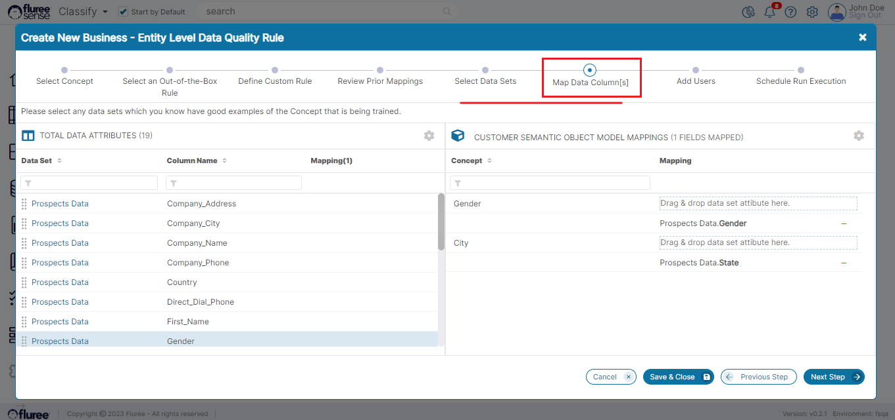

Mappings are the lifeblood of our _Classify_ product and it enriches and powers the Machine Learning System. Therefore, while creating a Business Rule, you have the flexible options to Remove Existing Mappings and / or Add New Mappings to your _Concept_ as part of the rule.  
  
The important thing to note is that this applies to all _Concepts_ present in the exception conditions.  
  
As an example, let us take the rule below which is made up of two exception conditions related to ‘Gender’ and ‘City’ Concepts.

**Where are the Mappings added/changed when Creating a Rule?**

1. In the _Business Rule Creation_ section there are screens in the workflow to ‘Review Prior Mappings’ and ‘Map Data Column(s).’ If you’ve gone through the Section on [Training model at _Concept_ level](/docs/sense/Classify%20Module/Classification%20Model%20Training/Training%20At%20Concept%20Level/index.md), you may recall seeing something similar there. So essentially, by adding / removing mappings just before running a rule, we provide new inputs for the Tenant-wide _Classification_ process which will run as part of the Business rule.  
      
    For the example above, let us see the screen that lets you review prior mappings or add new ones:

And in the subsequent step you’ll see both concepts appear as options for adding new mappings.

2\. Concept Mappings can also be changed for existing rules, and this can be done through the **Applied Mappings** tab. We’ll cover this in detail in a [different section](/docs/sense/Resolve%20Module/Data%20Quality%20Rules/Rule%20Applied%20Columns/index.md).

**How are these Mappings used?**

In the Background, when your Rule will run, it will also trigger a _Classify_ model on the whole tenant, so as to take into account these mapping changes and any other changes in the system. This happens irrespective of whether you’ve changed mappings in this particular rule or NOT - as there may have been other changes in the system to keep track of.  
  
While we’re on the subject of providing mappings to _Concepts_, let's recall [the intro section of _Classification_ modeling](/docs/sense/Classify%20Module/Classification%20Model%20Training/Introduction%20To%20Classification%20Model%20Training/index.md) where we had covered 5 ways of providing _Classification_ feedback. The above two are additions to this list making it seven now!
