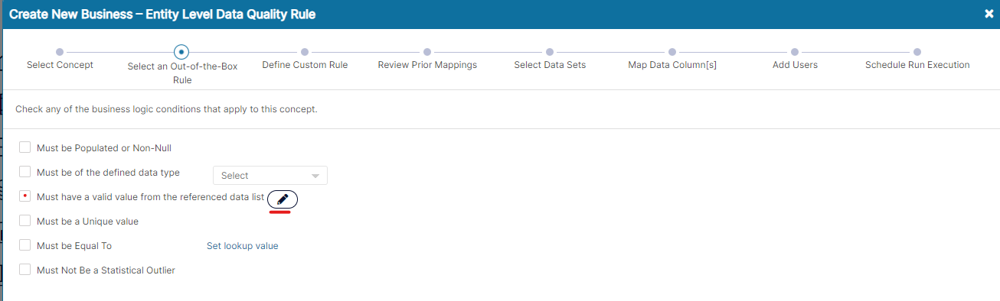

An ‘_Out of the Box_’ Rule as the name suggests is a pre-packaged or pre-developed rule that just needs some minimal information to be set-up and validate quality on certain aspects.  
  
_Out of Box Rules_ are Only available as _Business Rules_ and can be created during the normal create flow either separately or together with another custom rule.  
  
Each ‘_Out of the Box_’ rule corresponds to an exception condition which the rule validates. Currently Fluree Sense provides for the following _OOB rules_:

| **OOB Rule** | **Exception Condition** |
| --- | --- |
| Must be Populated or Non-Null | Value is null |
| Must be of the defined data type | value is not of  data type selected in drop-down in OOB screen. |
| Must have a valid value from the Referenced data list | Value is within (dataset details provided in OOB screen) |
| Must be a Unique value | Frequency is greater than 1 |
| Must come Before | Is greater than - Threshold value provided in OOB screen ( Date related) |
| Must come After | Is less than – Threshold value provided in OOB screen (Date related) |
| Must be Equal To | is not equal to – numerical threshold value |
| Must be Greater Than | Is less than or equal to – numerical threshold value |
| Must be Less Than | Is greater than or equal to  |
| Must Not Be a Statistical Outlier | z-score is greater than 3 |

**_OOB Rules_ integration with Resolve**

_OOB rules_ are integrated with the Resolve product , if that is licensed along with _Classify_. The rules that we set up on _Concepts_ (or _Entity Attributes_ as we call them in _Resolve_), appear there in the ‘_Define Data Quality Rules_’ screen for an Entity. This has been discussed in detail in [this section of Resolve](https://sensedocsdev.wpengine.com/data-quality-rules-for-entities/).  
  
Let us also touch upon a special _Out of the Box rule_: ‘Must have a valid value from the Referenced Data list’.  

This rule allows the user to ask for validation that all the values of the concept are from a specific list – This list can be composed of a distinct list made up of columns and we’ll just see how.  
  
The next screen shows how the rule’s Reference Data is set-up in 6 quick steps after we click the edit pencil icon to create this _OOB rule_.

**System Validations**

1. There can be one _OOB rule_ of a specific type on a concept. For this reason, cloning is disabled for _OOB rules_ and the _OOB rule_ condition becomes disabled the moment it is created – which is on the press of the Next Step button on that screen.  
    

3. You can only edit the Description of _OOB rule_ in edit mode – even when you’re the Rule Admin. Since OOB rules are for a specific predefined reason and have pre-defined exception conditions, you cannot change these aspects and its name, dimensions etc.  
    

5. Some _OOB rules_ are only visible in the OOB screen (as seen above) if the Data corresponds to a specific Data Type. For example – Must Come Before and Must Come After will not appear if the DataType of the concept is not _DateTime._  
    

7. If you have the _Resolve_ product, these _OOB rules_ appear in the Resolve product as the existing defined Data Quality rules on _Entities_.  
    

9. The rule for Referenced Data has additional validations such as:

- The drop-downs in the opened pop-up are dependent on each other and the Data sources, Data Sets filter to the ones for which the user has at least Read rights

- The Apply Changes button only gets enabled if there is at-least one row for the Reference Data List (but there can be more than one)

- Once the changes are applied, they show up in the _OOB rule_ screen but can still be edited from there before ‘Next Step’ is pressed in the parent screen. Once ‘Next Step’ is pressed, the rule is created (as is the convention for _OOB rules_).
