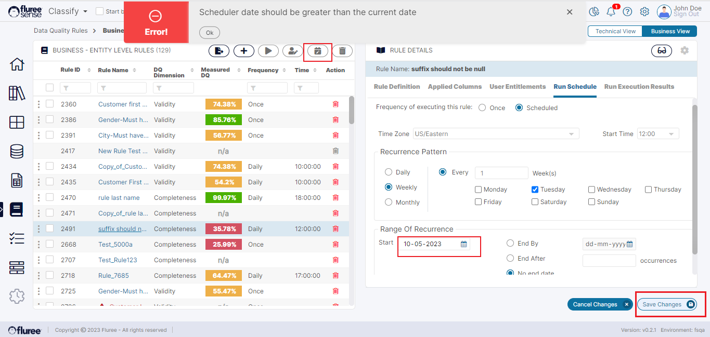
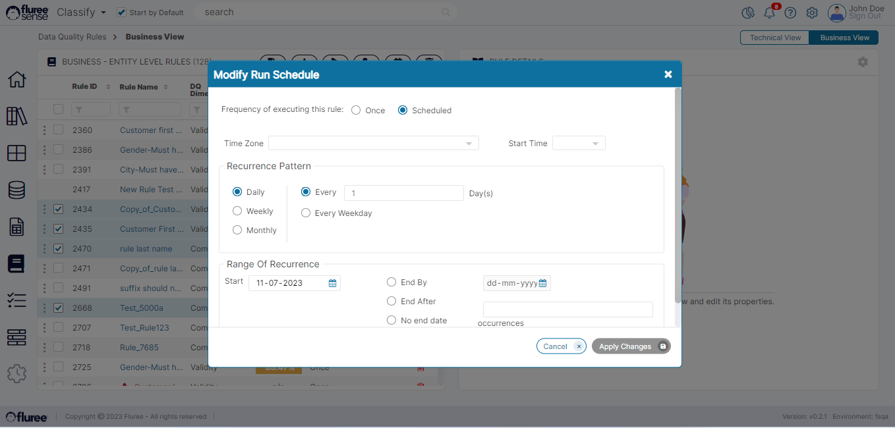

A Rule’s schedule is the cadence it runs on. A rule can be triggered either once or according to a schedule.  
  
Data Quality Rules can be scheduled in 3 ways:

1. During creation in the Rule _Create_ workflow

3. While editing the rule in the ‘Run Schedule’ tab

5. Through Bulk Edit where multiple rule schedules can be overwritten.

Scheduling is possible both for _Business_ and _Technical_ _Rules_. Data Quality Rule Scheduling allows a user to run the rules as per a predefined schedule and hence review and assess the Data Quality on a regular basis.

Before we Look at these 3 ways, let us quickly go over the important information that you can provide in the _Run_ _Schedule_ section and the flexible options available.

**Scheduling Options and Fields**

| Field | Validation | Typical Values / Example |
| --- | --- | --- |
| Frequency of executing… | Once / ScheduledDecides if the rule is executed on ad-hoc basis immediately with Save (Once) or executed as per a schedule (Scheduled).  | Defaulted to Once. If ‘Once’, then none of the fields below are required or displayed. |
| Time Zone | Time Zones from across the world shown ranging from GMT to EST etc. to provide the zone for the Start Time | Mandatory field |
| Start Time | The Time (along with time zone) at which the rule will execute on designated day as per the ‘Recurrence Pattern’ .  If the time has already passed, it will execute on the next execution date as per the cycle. | Mandatory field |
| Recurrence Pattern  | **Daily** :( Every  \[n\]  Day) / Every Weekday  **Weekly**: (Every \[n\] Week(s)) _Checkboxes for days of the week provided._      So, the User can choose one or more days of the week here.  **Monthly**: Flexible options to decide \[nth\] day of the month or nth day of the week of the mth month (Example:  2nd Monday of every 3 Months) | Daily – Every 1 day is the default. User needs to choose Daily/Weekly/Monthly and then the recurrence cycle.  System runs the rule as per the cycle. |
| Range of Occurrence  | Start Date: End By / End After / No End Date : Radio button where textbox is provided to fill in the first 2 cases and the 3rd case (No End Date), just needs to be selected. | Start Date is Defaulted to current date and mandatory.   Fill this and _‘Recurrence Pattern’_ with care as running rules use up resources. |
| Save & Close (button) | This means just Save the rule and let it run as per schedule OR if it is with ‘Once’ option, then whenever the user presses the Re-run Rule button – essentially in ad-hoc manner | Will be enabled both for ‘Once’ and ‘Scheduled’ but for Scheduled it requires all mandatory fields of scheduling to be filled. |
| Save & Run (button) | This means save and immediately Run  | Will not be enabled if the rule is of ‘Scheduled’ type. |

Now coming back to the ways of Scheduling:

- The example of the first way of Scheduling during creation can be seen in _Technical_ or _Business_ _Rule_ Create flow.

- The below images show how we can edit the Schedule of a single rule.

Schedule can be edited to the below after clicking the Pencil (edit) icon and clicking ‘Save Changes’ once done. Below is an example also showing how the screen validates the ‘Start Date’.

- Lastly, you can edit Schedules in bulk as seen in the image below by Clicking on the ‘Edit Schedules’ icon in the left panel header (marked in the image above) after selecting the rules to be edited using the check boxes.

**System Validations**

1. All the Screen input field specific validations as covered in the table above are applicable.

3. Whether editing rule in bulk or individually, you can only select them OR click on the edit icon if you’re the rule Admin of those rule(s)

5. When editing rule schedules in bulk, remember that it’ll change all of them to the one you save.
