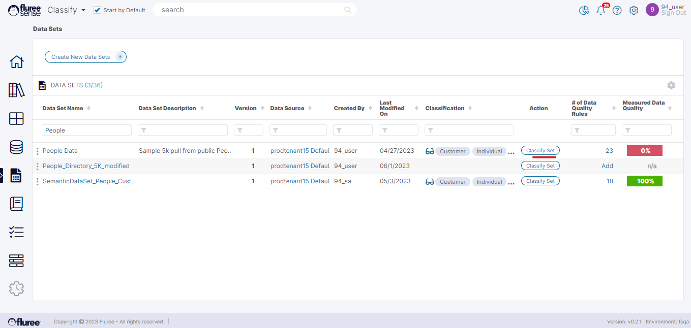
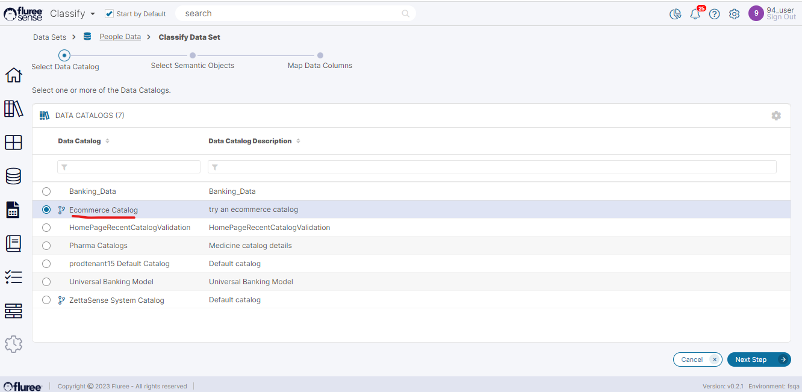
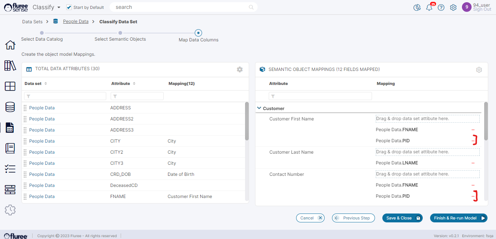
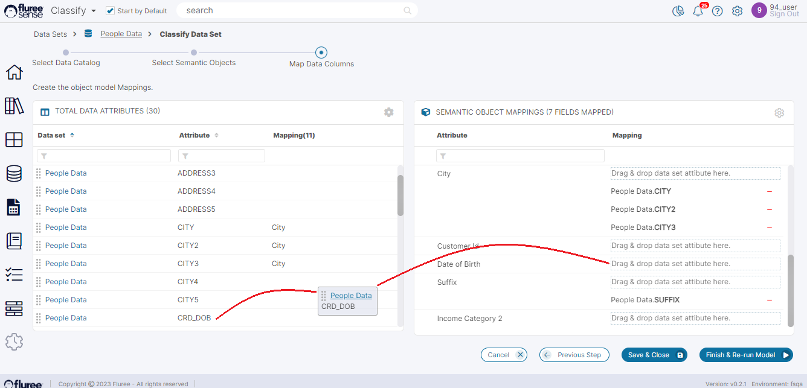

A logged-in user with _Read/Write_ or _Admin_ Entitlement can Classify the Data Set through:

1. The Data Set details screen by clicking on the ‘_Classify Set_’ button in the common header.

3. The Data Set List screen by clicking on the _‘Classify Set_' button.

**Step 1:** If the user clicks on this button, they will be directed to the list of catalogs that they have access to. They will need to select the _Catalog_ whose _Semantic Object_ they want to classify the Data Set with.

**Step 2:** Once Catalog is chosen, the Next Step button will get enabled and the user can go to the next page.

**Step 3:** In this screen, the user will be shown the list of all _Semantic Objects_ from the Catalog and will need to select which _Semantic Object_ they want to classify this Data Set to and proceed to the _Next Step_. The user is free to choose more than one as well.

**Step 4:** Next, the user is taken to a mapping page with the Data Set attributes on the left panel and the concepts grouped by _Semantic Objects_ in the right panel. Here the user will see existing mappings (of that Dataset to concepts of _Semantic Objects_ that were selected in Step 3).

Here the user can do two things.

- Remove any incorrect mapping(s)- for example, here the user can remove PID mapped to phone no. if it seems incorrect.

- Drag and drop additional Data Set columns from the left panel and map them with the Concepts on the right panel, if required.

Once this exercise is complete, then, on clicking the _Run Model_ button, the user triggers the _Classification_ Job which will consider these manual mappings and generate more mappings based on Machine Learning. The Job may take a little while because it runs for the complete _Tenant_ to automatically manage new changes in the model. Additionally, Data Quality rules will also be run to take note of any changes due to changes in mapping during the model run.

