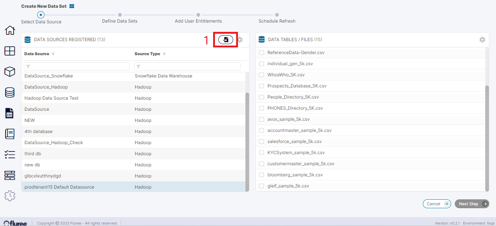
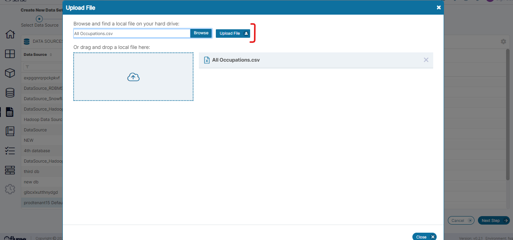
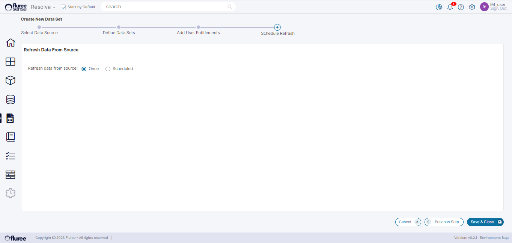
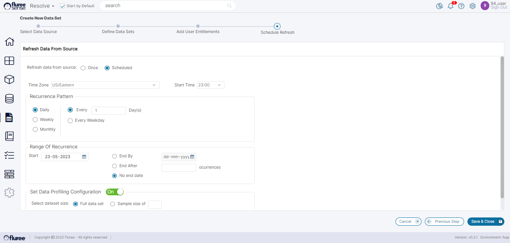
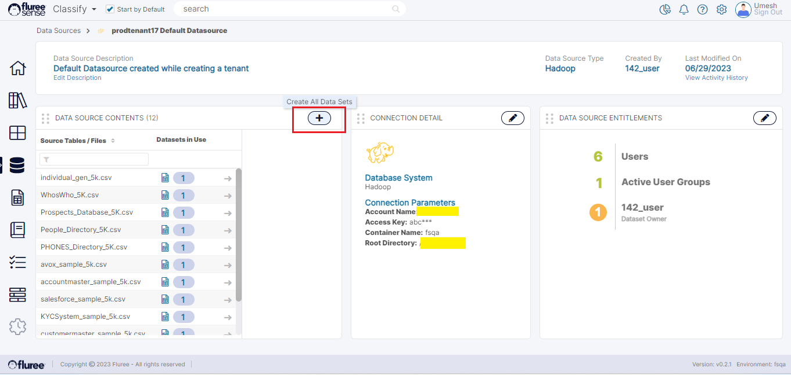

New Data Set(s) can be created by selecting the required Data Set content files **OR** by a Create All Job from the Data Source screen. Let us look at the first way below:

**Step 1**: The user can start the new Data Set creation process by clicking on _Create New Data Set_ button on the top left of the Data Set Listing screen:

The user will be directed to a page with a list of Data Sources they have access to:

**Step 2:** After the user selects the Data Source, the files in that Data Source will appear on the right side of the screen, as can be seen above.

The user can now select a file already in the Data Source from the Right Panel, or they can upload a file from their local machine by clicking on the _Upload New File_ icon, marked (1).

If the user clicks on the _Upload New File_ icon, they will be directed to this popup using which they can browse their local machine to upload a file, as can be seen below.

Once the user has selected and uploaded a Data Set content file, the next button will be enabled on the bottom right of the screen. Physically, this file is getting placed in the Data Source we selected in the first step. Please note that there may be file size restrictions at server level. In case an error regarding such a restriction is seen, it can be discussed with support to provide for appropriate customization.

The user can choose to create Multiple Data Sets by selecting the appropriate Data Set Content File(s) / Tables although in this example we've just taken one.

**Step 3**: The user will now be directed to the _Define Data Set_ screen. Here the user will need to:

1. Name the Dataset

3. Give an optional description

5. Select the file type and delimiter

7. Select if there is a header row

9. Define a schema if there isn’t a header row

**Note**\- The _Data Set Name_ needs to be unique for the _Create Dataset_ process to continue. The user will be alerted if it is a duplicate name .

The user can also click on the button at the top of the screen labeled '_Automatically Detect_', marked (1) which will try to detect the file type, delimiter, and schema of the file if the user doesn’t know.

However, if it’s a CSV file, the user just needs to choose the File Type, Delimiter and specify whether Header Row is included (It’s most likely that the CSV will have header column names).

After the information is provided, the _Next Step_ button will become enabled at the bottom of the page and the user will be redirected to the user Entitlement page.

**Step 4:** In the _Add User Entitlements_ screen, the logged-in user can add additional users, who will have access to this dataset.

The user has to click on the user group on the left panel and then click View Users in that group. Here a list of users in the group will appear on the right panel. The user can now assign who will have rights to this Data Set as an **Admin,** as **Read Only** or **Read/Write**.  
After at least one entitlement is provided, the _Next Step_ button will appear on the bottom right of the screen.

**Useful Note:** Additionally, you may notice the row marked '_New User Default Settings_'. This allows you to choose the Default entitlement for any new users of the _Tenant_. This avoids having to set entitlements one by one for multiple users. If you want to provide an Entitlement which overrides this default, then of course you can go to that Data Set and apply it for that specific user.  
You can also keep this blank which would mean that there would be no default Entitlement applied to New Users.

**Step 5:** The user is now directed to the _Refresh Schedule_ page where they can schedule a time for the Data Set to be refreshed and re-uploaded if they expect new data to be dropped in the Data Set. For this, they’ll first choose if it is a one-time upload or a scheduled upload.

Choosing the ‘Once’ option obviously does not require more detail, but if you choose the _Scheduled Refresh_ option, you will need to provide the refresh Start Time, Recurrence Pattern, etc. according to the screen below. You also have the option to choose whether to profile the whole Data Set or just a sample. It is advisable to profile the whole Data Set unless it is huge.

After the user sets a _Refresh Schedule_, they can click on Save and Close, and then the _Dataset Registration_ and _Profiling_ will take place.  
  
The _Dataset Registration / Profiling_ happens as a Job and you will see the familiar top-hat blue notification indicating that the Job has been triggered. You can choose to move ahead with other work while the Job completes and can keep checking the _Job Status_ in the Jobs tab on the left menu.

**Create All Data Sets of a Data Source**

**N**ow that we've seen how to create Data Set from selected Content files, let us also look at a bulk Create all process where by clicking a single button, any user who is having the Data Source Entitlement can trigger Data Set creation and registration for All the Content files of the Data Source. This obviously is reserved for very exceptional cases otherwise we do recommend selecting one or more content file(s) and using the above flow. If this method is used, the System will generate unique names for new Data Set corresponding to each content file BUT the system will not check if Data Set(s) from existing files are already present.

Since the Data Set names gets numbers appended at the end to maintain uniqueness, they may look duplicate in the list but are not. However, like we've pointed out above, please use this feature selectively with care. The below image shows how the user can trigger this from the Data Source Detail screen - where the user is a Data Source Admin:

