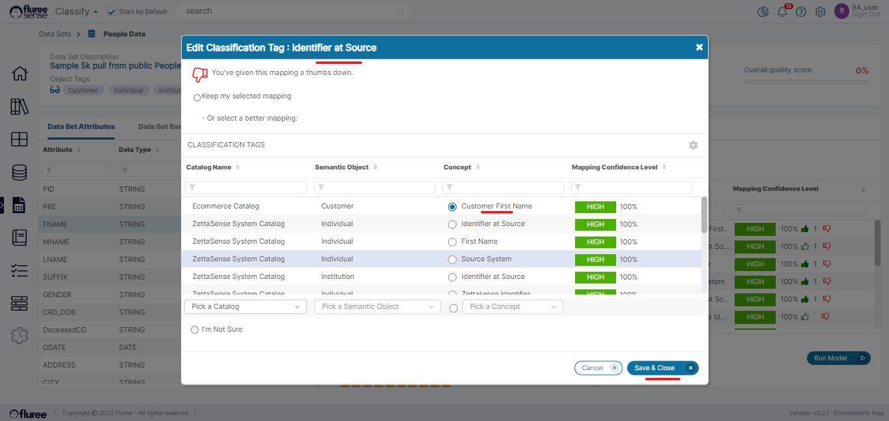

In the _Dataset Attributes_ tab, which opens as the default tab for a Data Set, the user can perform 2 main actions:

1. They can give feedback on the _Classification_ tags for each Data Set column, OR

3. Classify the Data Set itself from the common _Header_ section.

To give feedback on _Classification_ Tags linked to a Data Set column, please follow the steps below:

**Step 1:** Select a specific Data Set column by clicking on it  
  
After the user clicks on the column, the column profile will appear in the middle panel and the classification mappings and predictions will appear on the right panel along with the confidence score.

**Step 2:** If you agree with the classification, click on the green up arrow (‘upvote’), and if you disagree then you can click on the red down arrow (‘downvote’)  
  
Let’s take the case of a downvote here and consider the ‘_Identifier at Source_’ concept in the 2nd row. Assume you are downvoting as this is not the right mapping. Now, if you click on the downvote icon a popup, as shown below, will appear for the user to select a new mapping.

**Step 3:** Select an alternative mapping in the case of a down-vote (or you can even pick: I’m not sure)

Press Save and Close after making the selection. In this case, we are essentially saying ‘FNAME’ is ‘Customer First Name’ from _Customer Semantic Object_ in _Ecommerce Catalog_ instead.  
  
On pressing Save & Close, the pop-up closes saving your choice. Your down-vote should now register indicated by the icon against the downvoted mapping turning fully red. But this will also have another impact. Since you provided an alternative mapping to ‘Customer First Name,’ that will obviously count as an up-vote.

**Useful Note:** Notice the counts next to the upvotes and downvotes. This is, in fact, a key feature of the feedback system across _Classify_, providing collaborative feedback through multiple users. Clicking on the counts next to the Upvote or Downvote icon shows who all have voted for it.

As we can see from the screen above, we had downvoted Identifier at Source and it has the downvote icon showing bright red. Clicking on the count(s) next to it shows that you, as the logged-in user, did indeed downvote this mapping on 8th June 2023. 
  
But wait, we had also specified that the alternative mapping i.e, Customer First Name will also get upvoted, because you chose it instead. So, let’s see if it has actually happened.

As we can see from the screen above, it indeed seems to have happened thereby completing the full impact of the feedback given. Now let’s take a look at the System Validations for the feedback system here.

**System Validations**

1. Users with access to the Data Set can provide feedback here by upvoting or downvoting.

3. Upvoting or downvoting increases the count next to the icon and adds a background color to the icon for the current user as an indicator of his/her response.

5. Toggling from upvote to downvote on the same mapping will toggle the color as well.

7. You cannot provide the same feedback multiple times, and the most recent feedback is counted and registered in the history log popup.

9. Downvoting along with providing an alternative mapping is equivalent to upvoting the alternative mapping.

11. The score is calculated as the (Latest – Distinct Upvotes / Latest – Distinct Votes) x 100%

13. The run model button is / should be run after giving feedback to reflect the impact of feedback on related mappings. The result is reflected after the _Classification_ runs on other mappings as well.
