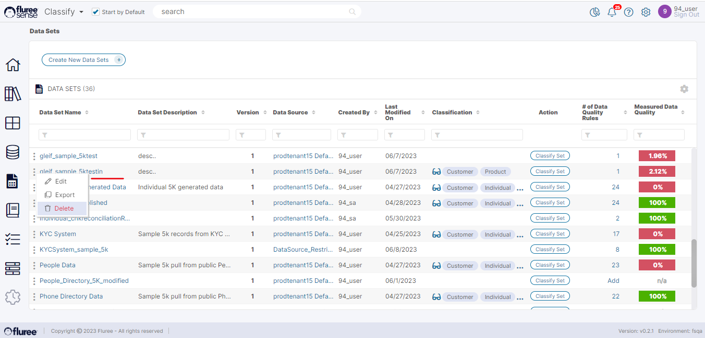

You can Delete a Data Set that you have no use for if you're having _Dataset Admin_ rights to that Data Set. This is a Soft-Delete and the file is not physically deleted because Fluree Sense simply captures the meta-data from the physical data. The physical data will continue to reside in the appropriate Data Source.

However, deleting a Data Set ensures that it is not visible or available for mapping / Data Quality, etc. and does not form a part of any useful operation.

To delete a Data Set, simply click on the _Delete_ link in the ellipsis menu beside that Data Set, in the _Data Set List_ screen. You will be shown a confirmation pop-up where you can confirm the deletion or cancel the process. Currently, there is no way of reverting this from the front end so please use caution.
