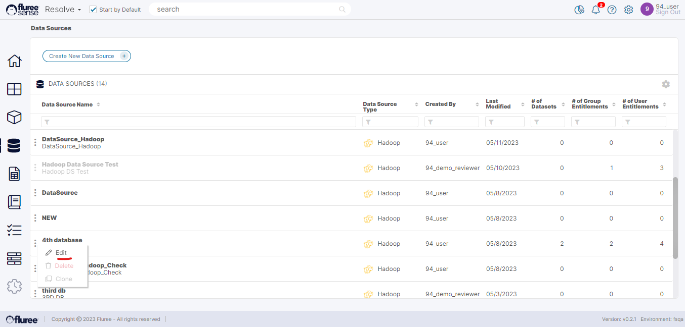

You can edit a Data Source that you have created if you have a _Data Source Admin_ role for that Data Source. Please follow the steps below to edit a Data Set. These are essentially the same steps as in the Create Data Source workflow. You may either just move to the Next step without making any edits in a specific screen, or make edits wherever you feel it is necessary.

**Useful Note**: An important thing to note is that you cannot change the Data Source Type or Sub-Type once it is created.

Here are the steps to edit a Data Source:

**Step 1:** Click on Edit Data Source Option from the ellipsis Menu of the Data Source to be edited.

**Step 2:** Edit the Name, Description and Connection Definition of the Data Source

As discussed in earlier sections, Data Source Type cannot be edited once set.

**Step 3:** Edit the Admin Users for the Data Source.

In this screen, simply remove or add users from the right panel to remove or add them as _Admin_.

**Step 4:** Edit the Data Source Content Entitlements for the Data Source

Simply click on the checkbox in the section marked 1 on the screen below. Follow through by selecting the User group(s) to edit in Step 2. You can choose more than one user group. In the final panel, add or remove users to associate or dissociate them with the selected files respectively, as shown in the screen below.

**System Validations**

1. The System Validation as in the earlier section related to Create Data Source flow shall apply.

3. The Data Source Type and Sub-Type cannot be changed once created.

5. The logged-in user cannot be removed as a _Data Source Admin_. A different _Data Source Admin_ needs to remove that user after logging in.
