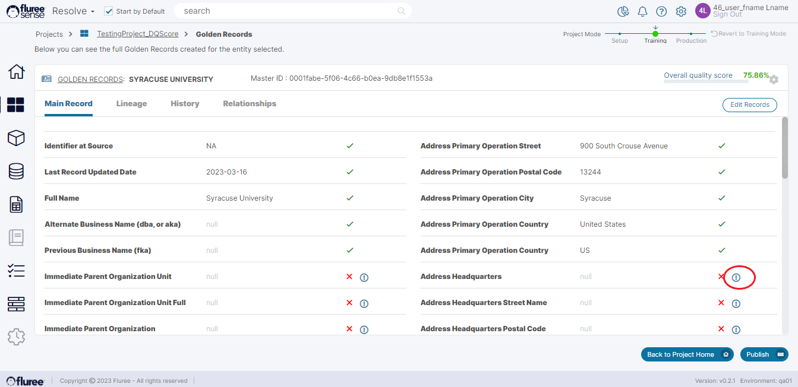
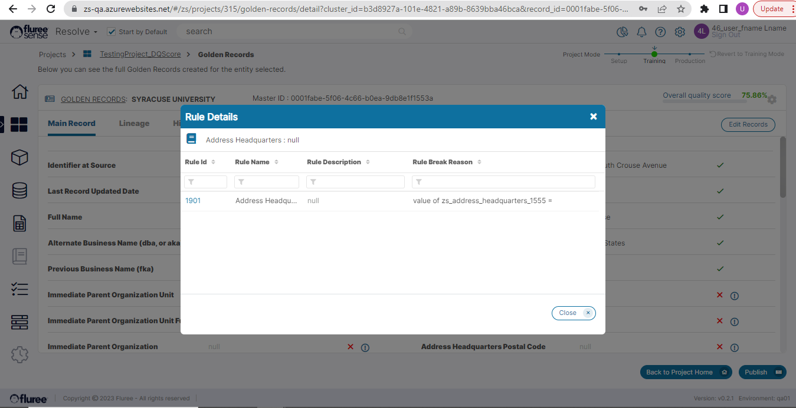

We’ve talked about the _Data Quality_ of Golden Records in the earlier section. Apart from metrics and summary information on quality, the system also provides details of exceptions and rules that caused conflict pertaining to EACH Golden Record.

Let’s take a case where the rules on attributes of that Golden Record have caused some exceptions. This could be due to _Entity OOB rule Exceptions_ or perhaps due to Rules created in _Classify_ impacting those attributes.

To view these exceptions, simply click on a Master Id in the Golden Records List which corresponds to the Record you’ve selected. You can use Filters and Sorting to search for the appropriate record.

These exceptions will be indicated as shown above in the image. The ‘Tick’ mark here indicates that that attribute has no exceptions whereas the ‘X’ mark indicates that the attribute has exception(s). This ‘X’ mark comes with an exclamation symbol which the user can click on to see the exception details such as Rule(s) failed, no. of exceptions etc.

**Useful Note:** More than one Rule may fail on a single _Entity_ attribute.

In the screen above, we can see how the Rule details are shown as well. On clicking the Rule link, the user will be redirected to the rule Id in the _Data Quality_ – Business View screen of Resolve.
