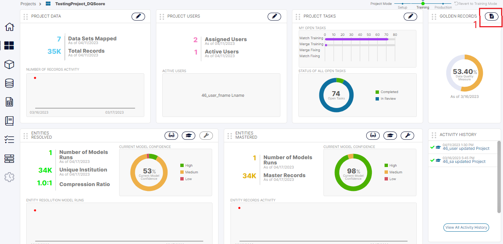
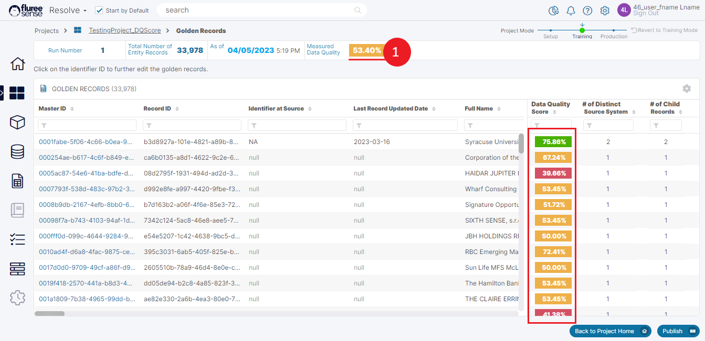

Now let’s talk about the Data Quality measure. For Data Management teams, It is important to gauge and improve the quality of data, especially for Golden Records which will be considered as a refined source of truth for the teams. To enable this, we’ve provided users with a holistic look at the Data Quality of the generated Golden Record Dataset.

Whenever a _Resolve_ Project ‘runs’ successfully and generates Golden Records, it also generates some metrics about the _Confidence_ and _Quality_ of these outputs.

To view the Project Home Dashboard, the User can click on a Project from the _Resolve_ Project List screen.

1. If the project has been successfully run or is in process, the dashboard will open.

3. If it is a project that is still yet to be run – it will open it in Edit mode.

The Project Dashboard Screen’s Data Quality section can be seen above on the top right part. This is the Data Quality of the complete Golden Records Data Set. On clicking the icon on the top-right of the screen (which is marked in red and numbered 1) the user is also able to view the Golden Records Details and view the Data Quality of Individual records in Golden Records.

