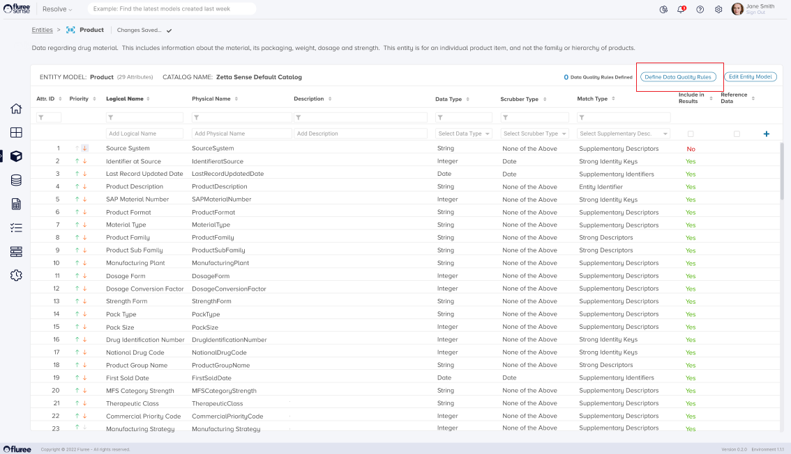
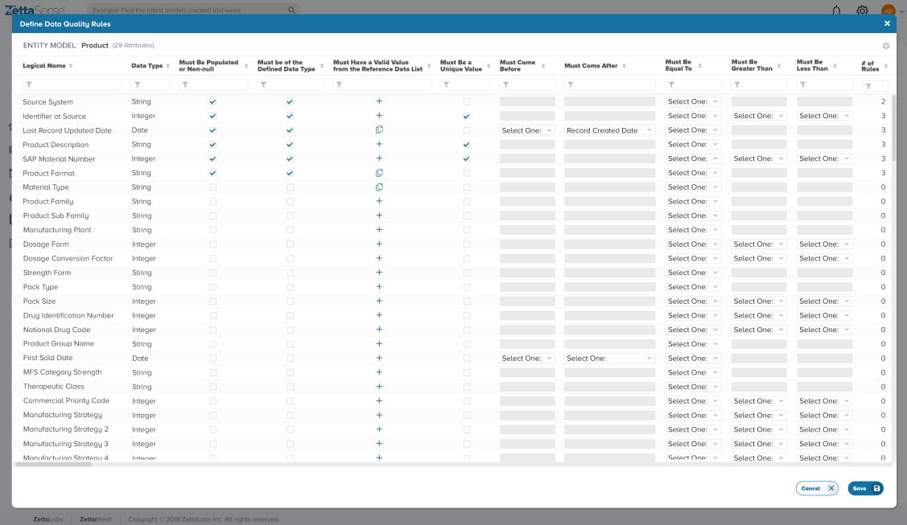
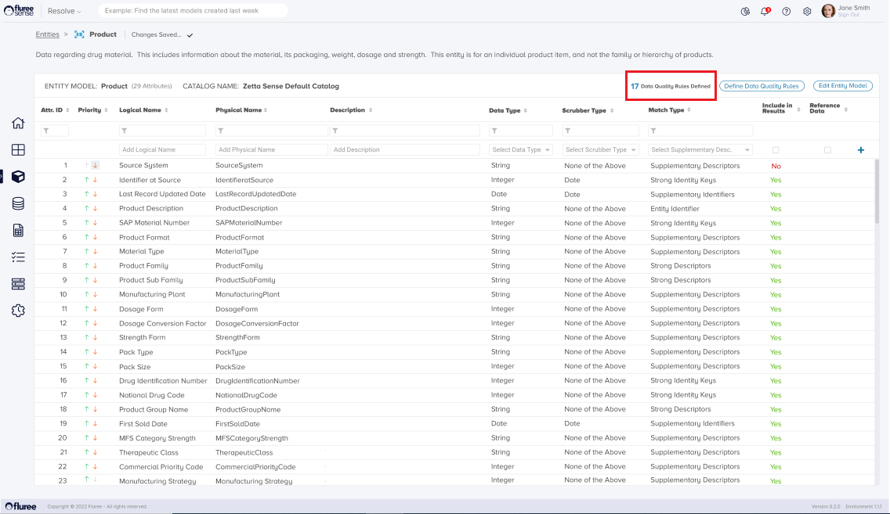

As explained in the earlier sections, the _Resolve_ project involves using Business Entities to generate a _Golden Record_, ideally containing the most complete and up-to-date set of information after complex matching and merging of operations. To get the most out of this process, keeping the quality of data used in those _Entities_ in check is important.

This is possible by creating Data Quality rules on the appropriate _Entity Attributes_ to check any data quality issue.

**OOB Rules for Classify:** Another way in which _Resolve_ and _Classify_ integrate powerfully can be seen in the Resolve module - the rules created here appear in _Classify_ as OOB (Out of the Box Rules) and vice-versa. This ensures non-duplication and seamless usage of the Data Quality Module.

Please follow the steps below to create Data Quality OOB rules on an _Entity_.

**Step 1. Click ‘Define Data Quality Rules’:**

Simply click the ‘Define Data Quality Rules’ button (as marked in the image below) to open the Data Quality Definition pop-up.

**Step 2. Check/Uncheck the Rules to Create on various Attributes:**

A pop-up, such as the screen below, opens after Step 1. In this pop-up, any attribute already having OOB Data Quality rules will be shown checked. You can uncheck – to delete such a rule and check others, where you wish to create a Rule. A special case is the ‘Reference Data List’ related rule, where you have to click on the icon to open the Reference Data workflow for setting up/editing a rule.

**Step 3. Save all Changes Once Done:**

Once all the changes on this screen are ready, you simply need to press the Save button to save what you just did. Once you click the Save button, the pop-up will close, taking you back to the _Entity_ screen with the updated information pertaining to Data Quality rules. In the image below, notice the section marked inside the red box. This section shows the total number of data quality rules defined.

**Useful Note:** Rules set up here will automatically get created on Save, take the logged-in user as the Rule Administrator and will be set to run as part of the Resolve project.

**System Validations**

1. On opening the ‘Define Data Quality Rules’ modal popup, the user will see existing Out of the Box rules on the attributes as shown in the grid by either a checkbox or the document icon in case of Reference Data rules.

3. The ‘Define Data Quality Rules’ button is enabled only if the user is an _Entity_ Admin of that particular entity.

5. Rules are not saved till the Save button is clicked.

7. These Data quality rules will get created immediately but run once every time the _Resolve_ Project is run to generate the _Golden Records._
