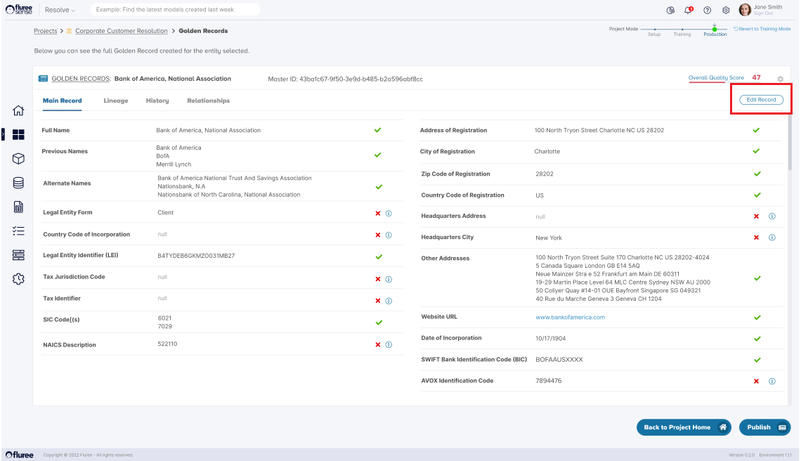
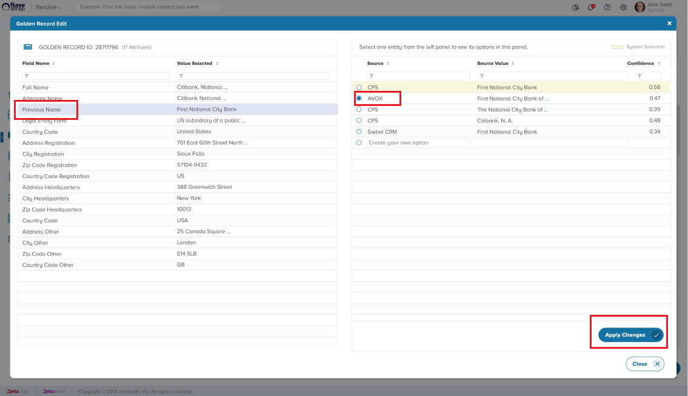
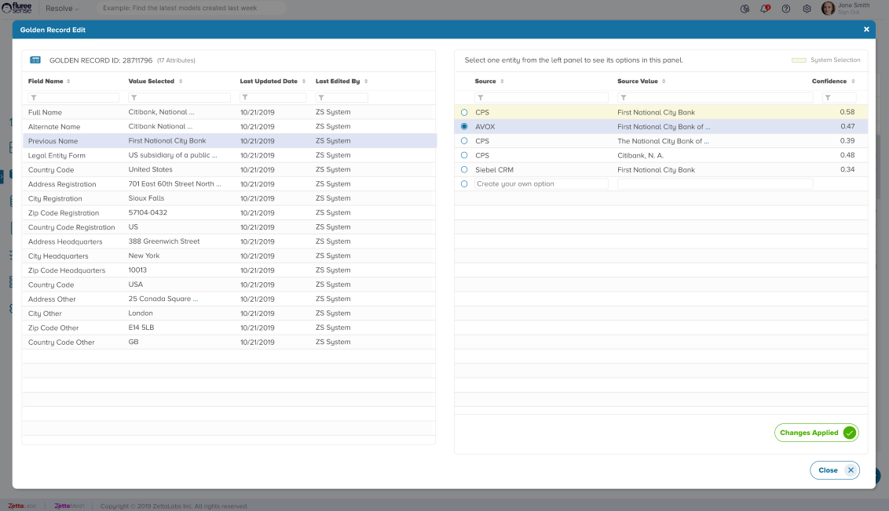

Golden Records get edited in two ways.

1. Whenever a model is re-run, Golden Records may get edited.

3. An authorized User can manually edit a Golden record as well.

To edit a Golden Record manually, the listed steps need to be followed.

**Step 1. Open the Golden Record to Edit:**

If you’re coming from the _Resolve_ Project Home Screen, then click on the Golden Records icon on the top right. A list of Golden Records will appear. You can browse or filter to choose the required one and click on the “Master Id” link.

**Step 2. Open the Edit Records button:**

Once the Golden Record details are opened, click on the _Edit Records_ button. This button will be enabled if the user has the _Entity Admin_ role assigned to them.

In the next screen, the user will be able to see the various attributes/columns of that Golden record on the left panel. On the right panel, the user can change the value of the selected attribute.

**Step 3. Edit a specific Attribute:**

In this screen, the user can change one attribute of the Golden Record at a time. The user should select the attribute on the left panel, which will show the other alternative sources for the selected record on the right panel. In the example below, the one with the highest confidence is shown highlighted on the right panel.

**Step 4. Click Apply Changes & View the Change:**

If the user wants, from the left panel, he or she can choose another source and value for the selected record. The results will get updated on the left panel with the new details. Alternately, the user can provide a custom value inputting it in the text box , (the last row in the image below).

With this action, the history of the Golden Record also gets impacted and this change is recorded in that tab. Changes in the Score / Data Quality due to such manual edits will only be visible once the Model is run again. Therefore, it is a good idea to make such edits in batches and run the _Resolve_ project once they are done.

