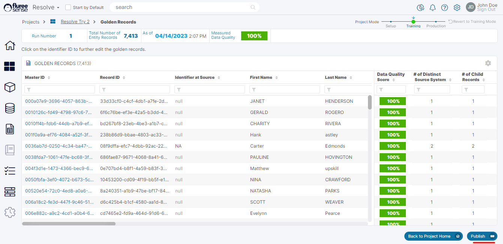
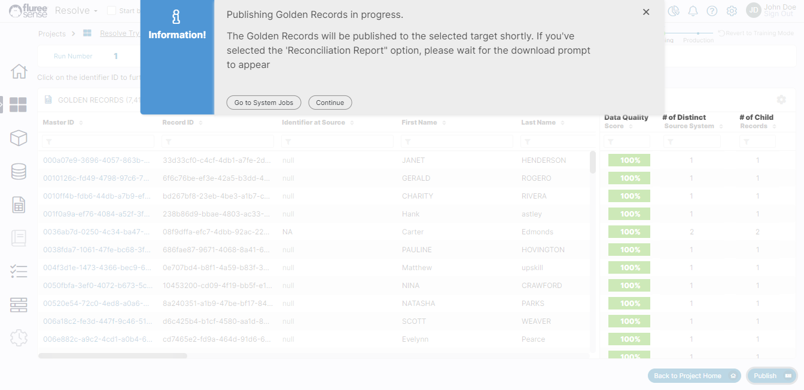

Once the Golden records are generated where you feel you have the requisite level of confidence and quality, you can go ahead and publish them. Golden Records can be published any time after the first run of the Project. There is no system threshold, confidence level, etc. for publishing and we’ve left it to the users to decide when they want to publish their Golden Records Dataset.

**What are the benefits of Publishing Golden Records?**

Once the Data Management Team has generated their final source of truth / enriched records, the next obvious step is to name and make it available as a Data Set that can be used by any of the authorized users of the system.

This is essentially what Publishing does – create a Target Dataset of these enriched Final records which can then be used by various teams and users as per the rights available to them from Dataset screens.

The following steps need to be followed to publish Golden Records.

**Step 1. Open the Golden Record Detail Screen & Press The Publish Button:**

You can publish the Golden Records any time after its successful generation. Click on the Publish button on the bottom-right of the Golden Records screen. A pop up will open to allow you to enter the publishing information.

**Step 2. Select the Target Data Source:**

Simply choose the Target Data Source from the list of Data Sources provided. This drop-down contains Data Sources of the _Tenant_ which are of HDFS/Cloud File Storage type and to which the user has access.

**Step 3. Optionally include Reconciliation Report Generation:**

A reconciliation report is a CSV file in a report form which contains the reconciliation or transformation details of how the source data got matched and merged to generate the Golden Records. If the _Reconciliation Report_ is included, it gets generated parallelly while Step 4 is getting triggered, and is available to download as a normal CSV file through a download prompt appearing on your screen. This may happen in seconds.

**Step 4. Review the Job Completion:**

The Golden Record publishing process is triggered as a normal job and as with any job in the system the user can go to the Systems Job screen to check the status of the Job. Refer to the screenshot below for more details.

