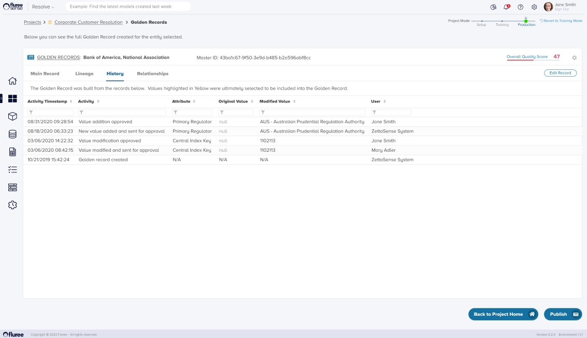

Each time a Golden Record is changed, including the first time it is assigned, its history gets appended. This is a simple log of what is happening with the Golden Record. A user can view the history of a specific Golden Record by clicking the history tab in the Golden Records detail screen.

As you can see, the latest change will show up on top, and the changes can be filtered or sorted. A history record gets generated whether the Golden Record changes through a manual edit or project run.
