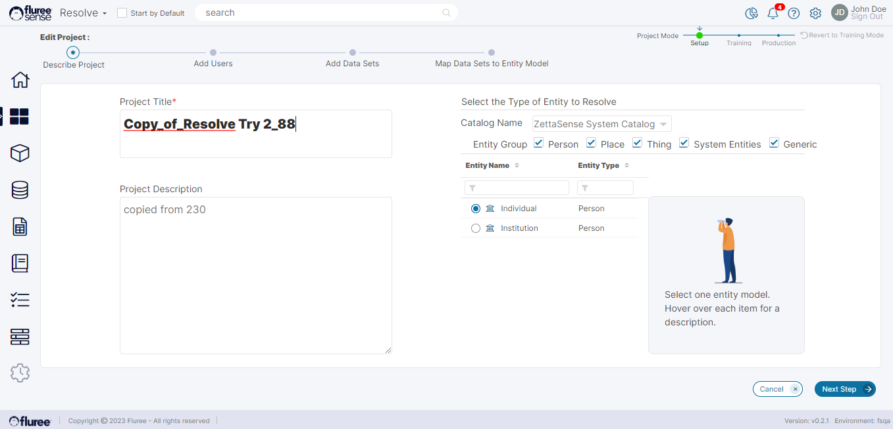

A "Resolve Project" can be cloned to allow a user to tweak or change the Project's inputs and re-run it while keeping the original Project intact. This is an A/B experiment option provided to users for their Projects.

In this example, the user clicks on the Clone for the above Project.

  
Cloning of a Resolve Project will replicate all the input data of the Project, i.e., the users, the Training and _Project Datasets, Entities_, etc. However, it will keep the name of the Project unique by changing it as follows (Here, 1873 is the unique Id of the original Project):  
Original Project Name: _Widget Project A_  
Cloned Project Name: _Copy\_of\_Widget Project A\_1873_

As one can see, the Project Title (or name) of the Cloned Project is generated accordingly.

**Steps to Clone a Project**:

1. One must have the Project Admin role for that particular Project to be able to Clone it. 

3. Browse to the “_Project List_" screen. 

5. Open the “_Quick Menu_” for your specific Project by clicking the ellipsis icon.

7. Click on the “_Clone_” Link to Clone the Project.

9. The first screen of the “Create Flow” will open with all the original information. Make Changes to the project information as required. (As shown in the above screen)
