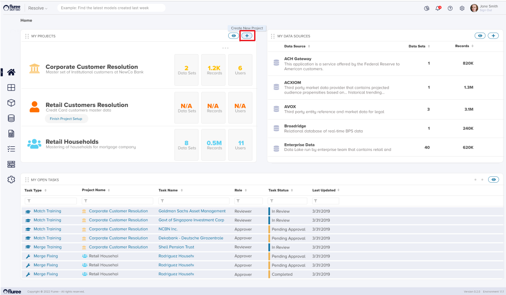
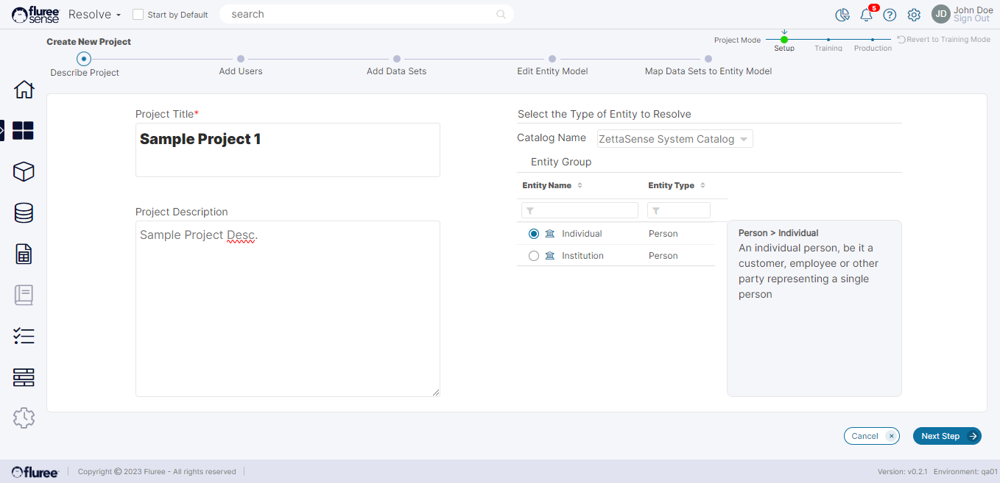
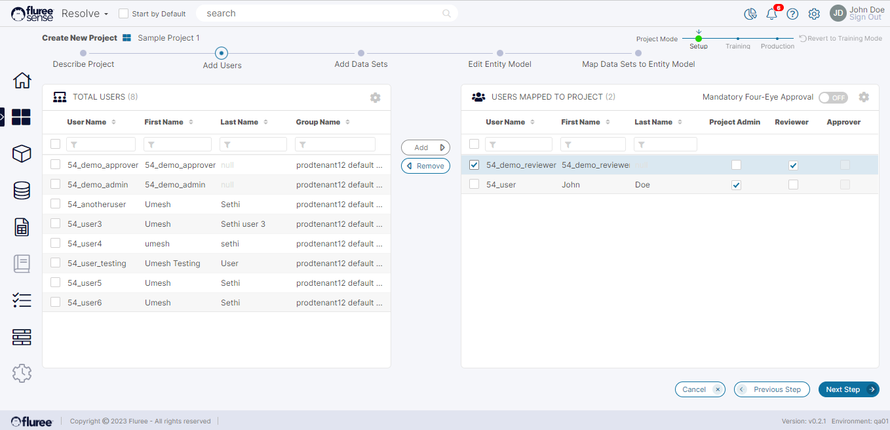
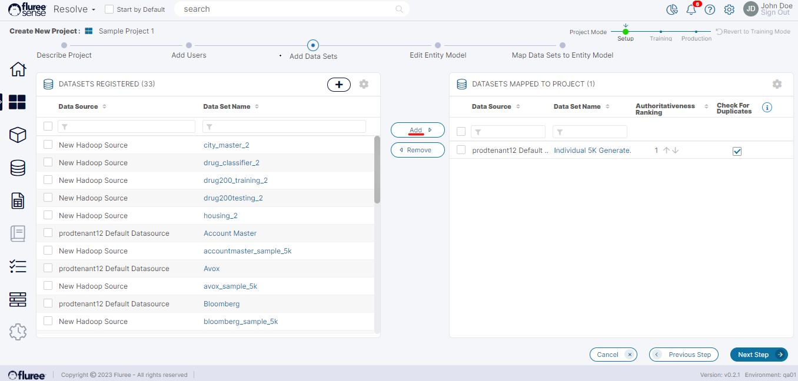
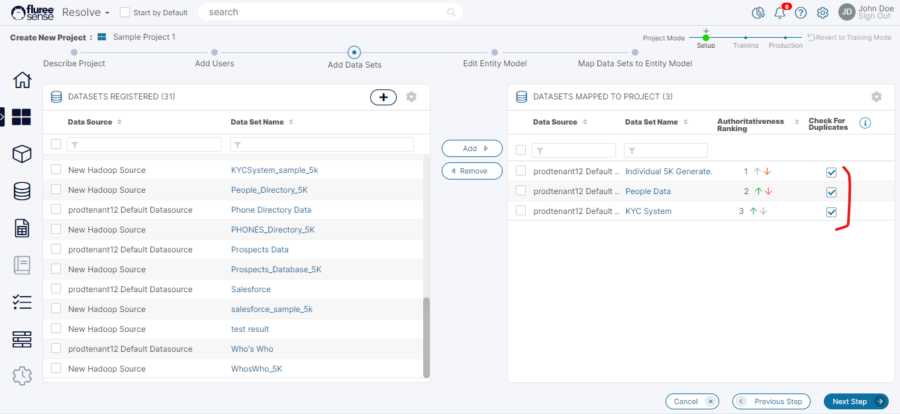
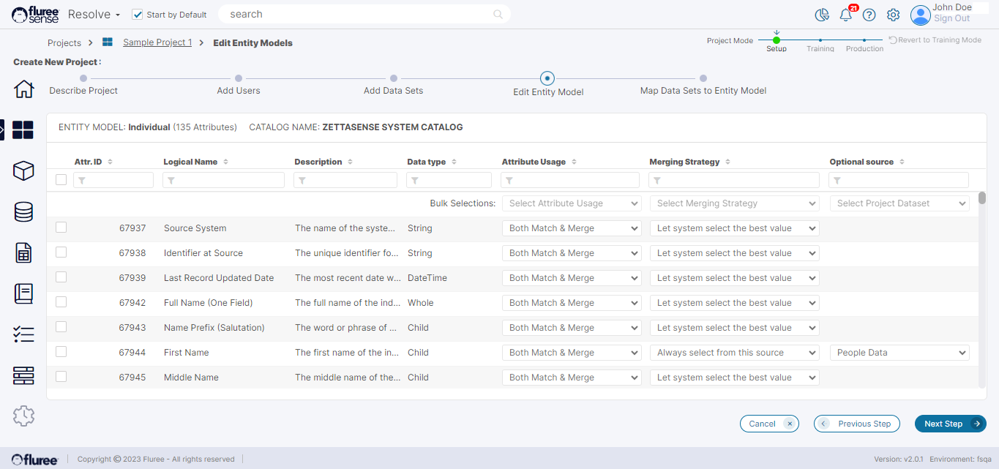
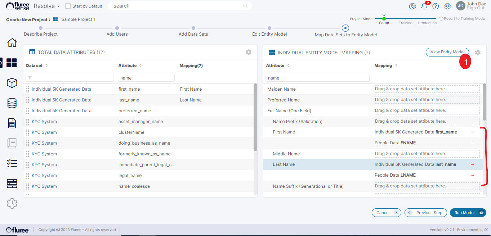
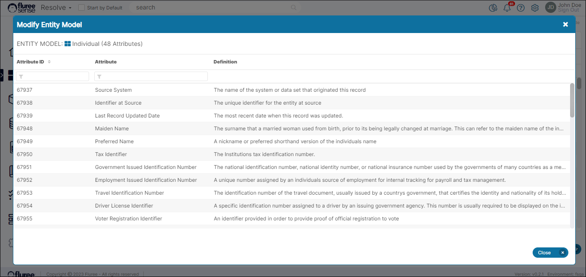
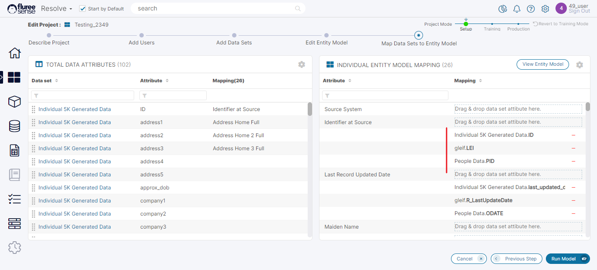

To create a project, go to the Home page of Fluree Sense and click on the “Create New Project” icon.

**Step 1. Describe the Project:**

Enter the name of the Project, select the _Catalog_ and then the _Entity_ that best describes the data you are trying to resolve. Optionally, add a description so that anyone who's added to the Project understands the scope.

**System Validations**

1. Once you enter a unique name and select _Entity_ type, the Next Step button gets activated. The entities are populated based on the Catalog selected, the default being the Sense Default Catalog.

3. If you enter the name of a project that already exists, the system will prompt you to enter a new unique name to continue.

**Step 2. Add Users and Assign to Project Roles:**

Identify which users have what access rights to this project. The Total Users panel on the left side displays a list of all Users in the system within the same Tenant and Group of the person creating the project. Highlight the Users from the left side and add it to the right panel by clicking the “Add” button.

Please note that you cannot add users from another Tenant or Group to your project. Only System Administrators can add or remove users to the Tenant or Group Lists. You can remove Users by selecting the names on the right panel and clicking the Remove button, which moves them back to the left.

**Step 3. Select and add Data Sets to the Project:**

On this screen, you can select the data sets from where the entity resolution and Golden Record creation happen. You will find the list of Data Sets registered by a Data Administrator on the left-hand panel. However, you can only see the Data Sets entitled to you by the Data Administrator.

**Note:** The images show an existing Project's flow in Edit mode, although it is the same during creation.

To add Data Sets to the project, select and highlight Data Sets in the left panel and click the "Add" button to move it to the right panel. You can also remove Data Sets by selecting a Data Set on the right panel and clicking the "Remove" button, which moves it back to the left panel.

To preview any Data Set (either on the left- or right-hand panel), click on its name, and a pop-up window will provide a Data Set Preview display.

From the Data Set Preview, you can quickly sort and filter data values within the columns using the filter and sort controls in each column. However, the Preview display will only show the first few hundred rows of a Data Set.

Once you add the Data Sets to the right panel, use the Up or Down arrows to sort in authoritative ranking. This means placing the Data Set on the list higher if you believe the Data Set is well managed & has a relatively higher quality of data compared to the others in the set or placing the Data Set on the list lower if you have less confidence in its data quality. This will be important for the Golden Record creation model, which comes later in the process.

Starting with version 2.4.4, we will also provide the capability of adjust the Data Set's authority through Drag and Drop, so as to make it easier to use.

**Check for Duplicates:** The Check for Duplicates (marked above) is another feature, checked by default, where we are essentially telling the algo to check for duplicates within the dataset itself, i.e., the entity may have a duplicate in the same dataset (to check across datasets given). If you are reasonably sure that we don’t need to check within the same dataset, you can uncheck this, thereby increasing the speed and performance of the algorithm.

**Step 4. Edit the Entity model for the Project:**

In this step, the screen loads to show the current Entity attributes , their description, data type and some configurable fields for each of these attributes .

These fields can be seen in corresponding columns next to each of these attributes in the image above. These fields and their use are as follows:

1. **Attribute Usage** : Attribute Usage is an important configuration field used to define whether this attribute will be used in Matching, Merging, Both of these or Excluded from both. This is because some attributes of the entity may not be required in the Merging process and just for matching or vica versa and some not at all. If an attribute is excluded here from both, it does **not** appear for mapping in the next screen. The default value is : 'Both Match & Merge'. The implication of these inputs is that the excluded values don't appear in that specific process results - and if excluded from merging then don't appear in Golden records as well.

2. **Merging Strategy** : As we know, the Resolve project first undergoes a matching process and then a merging process once the matching is complete. This configuration parameter indicates what merging strategy is to be used the algo for the attribute. These may differ from attribute to attribute. Firstly, this field gets disabled to 'Not Applicable' if the 'Attribute Usage' field does not refer to Merging. Secondly, this field has multiple relevant options such as: 'Let system select the best value', 'Always update with the latest value', 'Always Select from this source' , 'Combine/Concatenate all valid values'. The default value is 'Let system select the best value'. The implication of these inputs is the impact to the algorithm. For example, lets say you have the contact number attribute whereby a user may have more than one number. Then would you necessarily want to merge to pick **one** of these numbers in the generated golden records. Perhaps not. Perhaps, a better option would be to combine / concatenate all valid values which would mean that we combine using the comma separator - all valid values i.e. values on which no Data Quality rule has failed.

3. **Optional Source** : This configuration field is dependent on Merging Strategy and only becomes visible if the Merging strategy chosen for that attribute is : "Always Select from this source" . Why ? Because, now we need to provide the source or rather the Dataset (from the list of Data Sets included in the project) from where the attribute is to be fetched for merging. This is select list from which one Data Set value can be selected and the merged (Golden record) value shall be from this Data Set only - for this specific attribute.

Other considerations to keep in mind here are that any field excluded here OR any chained attribute will not appear in Step 5 and that the changes we apply here are only applicable to this project. There is another required field which is the 'Identifier at Source' which acts kind of like a primary key. Even if the user excludes this field by mistake in this step, it'll still appear in the next step as a required attribute for mapping because it is essential given that it is used for determining the primary key.

**Step 5. Map the physical data attributes to the Entity model:**

In this step, all the attributes of the Data Sets selected will appear on the left panel and need to be associated with the logical concepts of the project’s entity model. Please check the System Validations section below to understand the rules to be followed when mapping.

Each entity has a default data model that describes the concepts that make up that entity. Our Unsupervised Model uses those concepts to learn how to connect records without training. For example, an Entity such as an "Individual Person" has certain concepts that make it up:

- A name

- A home or mailing address

- A date of birth

- A phone number

- An email address

- An identification number

- Etc.

When mapping attributes to the relevant concept, our unsupervised model has some built-in knowledge of how to treat the data. For example:

- If it's a name, then normalize for different versions (such as Jim 🡪 James or Hans 🡪 John)

- If it's an address, then validate the address against a lookup list and confirm

- If it's a date, make sure it is in a valid format ( YYYY-MM-DD)

This makes the data more ready to be _matched_. Next, click the "View Entity Model" button to explore further the concepts that make up the entity selected for the project.

You can map a physical attribute to a logical concept by dragging an attribute from the left to the corresponding field on the right. The mappings will appear on the screen as you map physical attributes to the logical ones. (Below image corresponds to a different project.)

<figure>

<figcaption>

Map Data Sets Screen: A project showing the _Identifier Mapping_ system requirement fulfilled.

</figcaption>

</figure>

You can sort and filter the attributes or concepts on both sides using column controls to map the attributes faster. Once done with mapping, click the "Run Model" button to trigger the Unsupervised Model. The project has already been defined at this stage, and you wait for results.

**System Validations**

The above screen is the most important in this process- the place for multiple system validations and confirmation of prerequisites for a logical project execution.

1. **Map from Multiple Datasets:**  
    The Admin maps the Dataset Attributes on the left to the Entity Attributes on the right. One or more Dataset’s Columns can be mapped to a single _Entity Attribute_. Generally, one can understand this from how the data is scattered and spread to find a definitive source of truth for the set of records combining our data mappings.  
      
    

3. **Don’t map multiple Data Set columns from same Data Set to the same Entity Attribute:**  
    The Admin should not map multiple Data Set column of same Data Set to a single Entity Attribute as this is not a real-world scenario in most cases, and is precluded from the proper running of the algorithm. Future support for this is under consideration.  
      
    

5. **Provide at-least two Identifiers as a pair:**  
    Entity resolution model depends on defining one attribute as an entity identifier (e.g., what do you call the cluster) and at least one other type of attribute which could be any of the types in the table below. The matching rules will then always follow a two-part logic, e.g., if within a pair the entity identifiers are close enough AND the identity keys are close then boost the likelihood that the pair is representing the same entity.
    - If within a pair, the entity identifiers were not close enough or the identity keys were not close, then penalize the likelihood that the pair is the same entity. Based on the sum amounts of all the boosts or penalties, then the system would determine whether the pair is really the same entity or not. See the table below for the list of attribute types and the degree of boost/penalty applied.
    
    - During Project creation, if these two type of attributes are not defined, it should warn and stop you from proceeding.
    
    - These 'types' are defined in the Entities screen in Resolve for each attribute and can be reviewed from there. Lets look at them in Detail:  
          
        
        | Match Type | Examples | Match Degree of Similarity Required |
        | --- | --- | --- |
        | Identity Keys | SSN, passport ID, Tax ID, National Drug Code, Drug Identification Code | Perfect Match |
        | Strong Identifiers | Names, date of birth, gender, product descriptions | Strong Fuzzy Match |
        | Supplementary Identifiers | Addresses, phone numbers, weights, measures | Strong Fuzzy Match |
        | Strong Descriptors | Race, email, product family | Fuzzy Match |
        | Supplementary Descriptors | Industry codes, weights, measures, pack type | Fuzzy Match |
        | Automatic Splitters | Boolean flags to identify things that are not the same or do not belong together (e.g., manufacturer code) | Perfect Match |
        
          
        

7. **Pre-existing Mappings:**  
    Entities or Semantic Objects, as we call them in Resolve, can have mappings from Classify itself - a scenario where the user may map what he feels is the correct representation of a Semantic Object or a Concept, such as mapping a column Last\_Name to Last Name Concept of Customer Semantic Object (Manual Mapping). If such a manual mapping is active, i.e., when its score is above a certain threshold, considering multi-user feedback is possible, you may already see such mapping in this screen when trying to create your Resolve Project. So, you can fine-tune and:  
    a. Remove the mappings using the (-) icon, which doesn’t make sense.  
    b. Add additional mappings from left to right, satisfying these basic rules.  
      
    

9. **Mappings of Custom Entities:**  
    Note that the Entity in the above example came bundled with the Fluree Sense Catalog. However, if an Admin uses a customized/new Catalog, above rules including Rule #3 about the type of identifiers should be followed. We will cover this in more detail in the Entity Creation and Management section.
