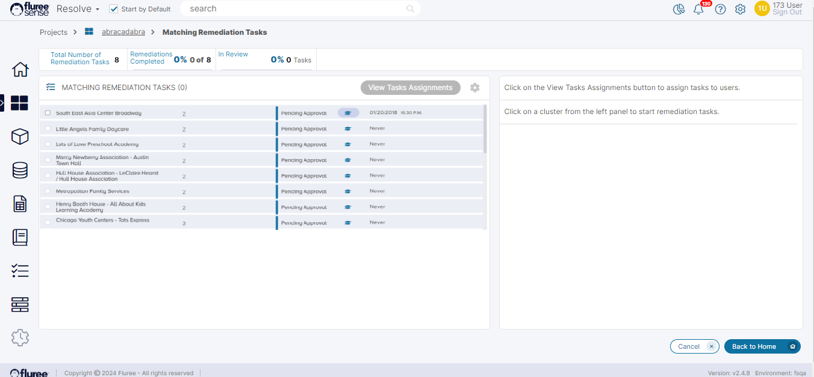

Fixing Tasks, as the name suggests, are the Tasks to "fix" any final or remaining "Data Issues," where the Machine Learning model can't be of much help. This usually happens when a machine learning model has reached or passed a threshold limit of confidence, after which tuning or training would lead to diminishing returns.

Therefore, there may only be a few "tasks" to complete at this stage – or in other words, a few sets of feedback items to complete. Typically, the Confidence level at which "Fixing Tasks" are generated is around 80%, but it can be tweaked if required for a specific client deployment.

Fixing Tasks look and follow the same workflow as the Training Task with the exception that there is no need to Re-run Model after Fixing something because now the user is just completing any final feedback manually.

Here are some other things to note when working with Fixing Tasks

- There are two types of Fixing types corresponding to the 2 types of Training Tasks . These are 'Match Fixing' and 'Merge Fixing' Tasks.

- When the model confidence reaches the threshold, the internal algorithm (called 'cluster picker') only returns the low confidence matches which're fixed.

- The workflow steps inside a Fixing Task are exactly the same as inside a Training Task. Only thing to remember is that the Golden records generated through fixing Tasks are not generated in bulk but the changes are applied on 'each' Tasks in near real-time. This is why there is no need of a re-run button in Fixing Tasks.

- Fixing Tasks also allow for re-assignment , follow 'Review' and 'Approval' process - depending on whether 4 eyes check is ON or OFF.

Below is a typical list of Fixing (or 'Matching Remediation' Tasks as they are called). These are accessible from the wrench icon in the Project Home Screen in the left side , in the 'Entities Resolved' section.

