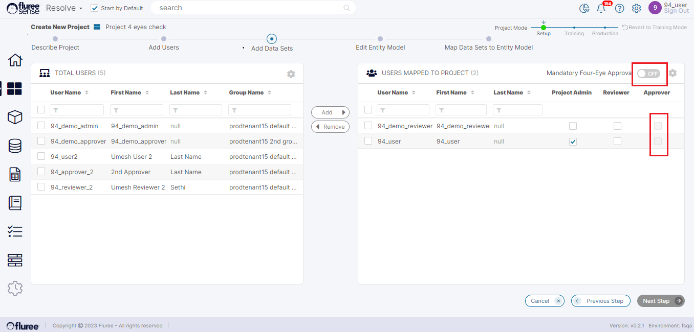

There are three types of roles in the system for any Project:

1. **Project Admin:**  
    Project administrators can modify a project, including changing the quantity of data sets to include, changing project user entitlements, or re-running models. By default, the person creating the Project takes on the Project Admin role.  
      
    

3. **Reviewer**:  
    This role provides 1st level feedback to a Training Task. Assigning a Reviewer to a _Resolve_ Project is mandatory, and you can have more than one Reviewer.  
      
    

5. **Approver**:  
    This role validates the feedback provided by the Reviewer. The System Administrator can set a parameter to determine whether independent Approvals (i.e.mandatory four-eye checks) are required.  
    

**System Validations**:

1. If the Four Eyes check is OFF (as shown in the image), the approver column is disabled.  
    

3. If the four-eyes are ON, then at least one reviewer and one approver are required. When it’s OFF, at least one reviewer is required for "Next Step" to be enabled.  
    

5. The user with an Admin role can't be an Approver or Reviewer for "Next Step" to get enabled.  
    

7. Each Project needs at least one user as Project Admin. There must be another Admin assigned before the logged-on user can be removed as Admin from the Project.
