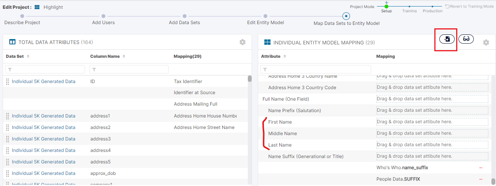
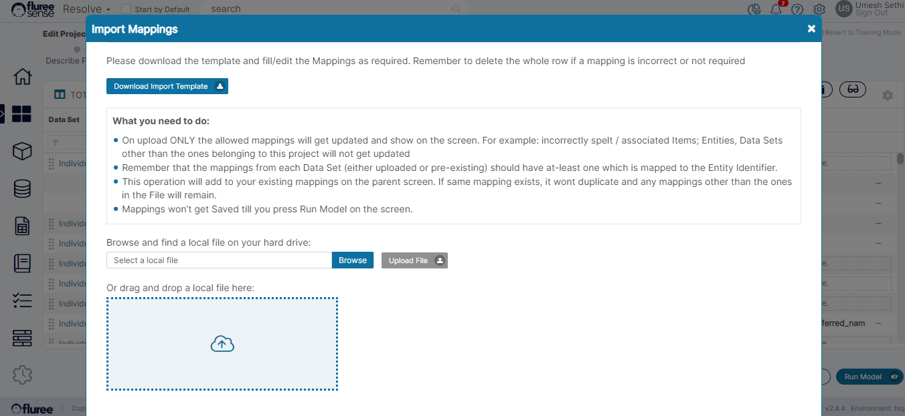
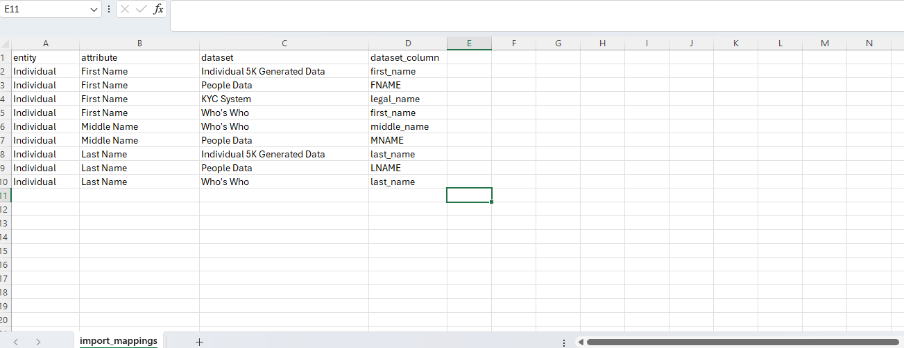
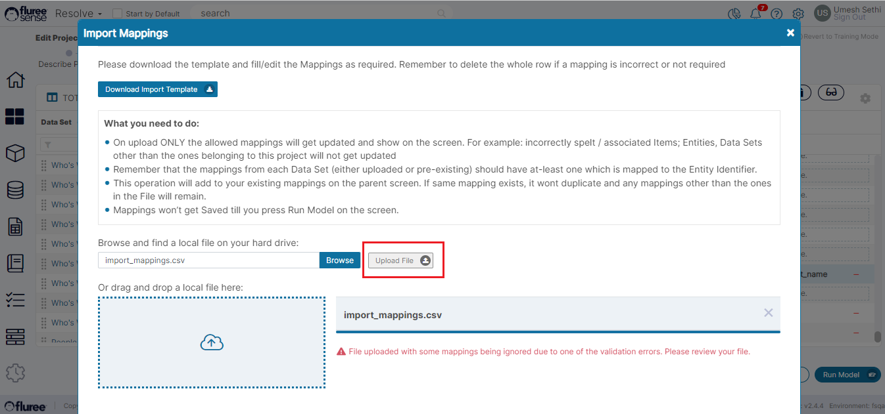
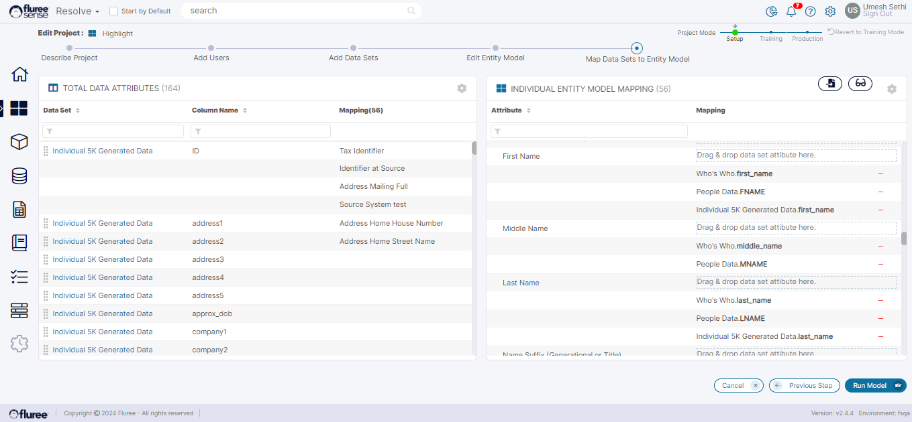

This feature provides a user with Project Admin entitlement , the ability to add mappings in bulk to a Resolve Project through CSV upload. This is a useful feature and an alternate to the drag-and-drop method of adding mappings in the '_Map Data Sets to Entity Model_' screen.

You can review the complete Resolve Project Creation process [here](https://sensedocsdev.wpengine.com/creating-a-resolve-project/?cid=40). The above screen will be a part of this flow as well as accessible when Editing the Project or from _'Manage Project Data'_ link from the project Home screen.

Assuming the user is now in this screen, let us review the Steps and validations involved in Importing Mappings:

**Step 1**: Click on the Import icon from the _'Map Data Sets to Entity Model'_ screen

Notice the 3 attributes we're going to consider in our import. The user should review the current state of the mappings. Any mappings imported while avoiding duplication, will get added to the existing mappings on the screen - once import is complete. The user should Click on the import icon now.

**Step** **2**: Download the Import Template from the Pop-up

As in other import screens, the user needs to download the import template which is a CSV file, first. A quick read of the instructions is helpful as well.

**Step 3**: Fill the Template considering the existing Mappings & adding New Ones

The user should fill the Template with attributes they need to map to. Screenshot of the filled file is provided here based on the 3 attributes considered in the first-step. In this case we'll have all the mappings correctly filled except one having a spelling mistake.

**Step 4**: Upload filled Template & Import to screen

When the user presses ' ' , the file upload will happen with the validations mentioned below. In case of valid mappings, the pop-up will close automatically & results will be updated in the screen. The system will automatically only import distinct valid mappings, filtering out duplicate ones. It should be noted that as is the functionality of this screen, the mapping's here are **not** the one's already persisting the database but the collection of those on which the model will run.

In this case, it is giving an error message in red that not all the rows mappings in the Import were correct, and as of now we're not providing specific error message for each row that fails. This is just to simulate a situation where one or more mappings may have mistakes. Another scenario is where all mappings are correctly filled in which case the file will upload, update the mappings and the pop-up will auto-close.

**Step 4**: Re-run the Model after any final adjustments

The user can still do any final manual adjustments after which they just need to re-run the Model which should work the same way that it does in case of manual drag and drop mappings. The project will re-run and generate the results based on these mappings. This is explained further in detail in the [Create Resolve Project Flow](https://sensedocsdev.wpengine.com/creating-a-resolve-project/).

Note the update to the mappings seen - all except one from the csv (which had error) got updated here.

**System Validations**

1. On upload ONLY the allowed mappings will get updated and show on the screen. For example: incorrectly spelt / associated Items; Entities, Data Sets other than the ones belonging to this project will not get updated

3. The mappings from each Data Set (either uploaded or pre-existing) should have at-least one which is mapped to the Entity Identifier.

5. This operation will add to your existing mappings on the parent screen. If same mapping exists, it won't duplicate and any mappings other than the ones in the File will remain.

7. Mappings won’t get Saved till you press Run Model on the screen (as in the case of manual mapping from screen).

9. If one or more rows of the import has error due to non existent inputs - such as Attributes / columns with spelling mistakes, blanks etc. it will show a standard error message signifying that one of more row's import failed. Similarly in case of all rows failing. The user should close the pop-up using 'Close' button and review on parent screen what failed.

11. If all rows of the import are correct, the popup will automatically close and relevant mappings get updated.
