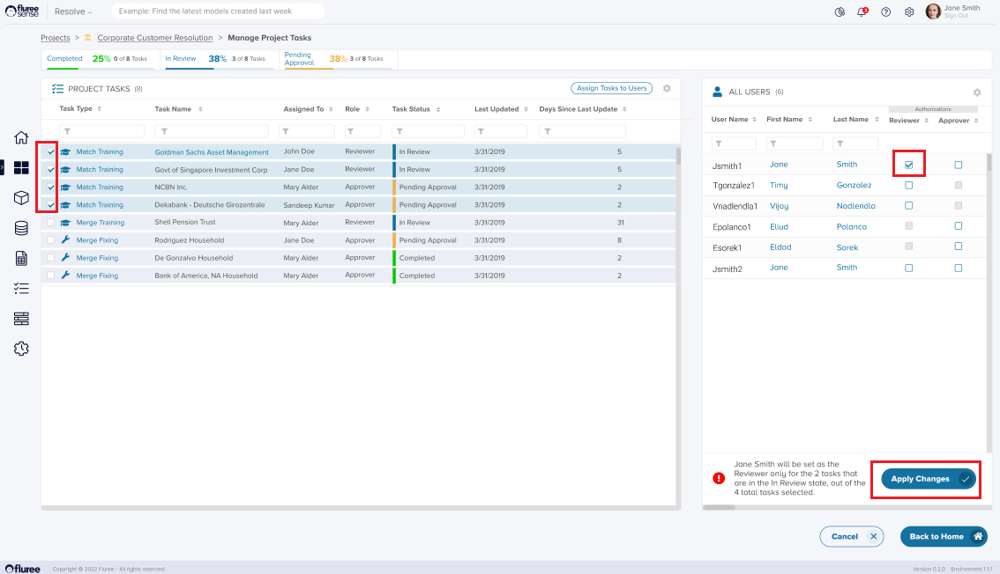

In the earlier sections, we've seen how a Project Review, Approver, and Project Admin can provide feedback for Tasks in the Project's "Train Model" screens. Resolve Projects also have a dedicated Manage Project Tasks screen **only** accessible by the Project Admin. 

A Project Admin can perform the following functions in the "Manage Project Tasks" screen

1. Re-assign one or more Project Tasks that are not completed to another Reviewer or Approver.

3. Give feedback on a Task that has not yet been completed.

5. View the feedback given to any "Completed" task.

In the screen above, when users click the icon marked 1, they are further directed to the "_Manage Project Tasks"_ screen. 

The screen above shows how the Project Admin can select multiple tasks which still need to be completed and assign them to other Reviewers or Approvers if required, provided the rules mentioned in System Validation are followed.

Apart from this, the Project Admin can give feedback to any in-complete task as an ad-hoc _Reviewer_ or _Approver_ or view the feedback for a completed one. The steps one needs to follow are the same as in the case of "Match" or "Merge Training," as the list displays all the "Tasks" of the Project, where each Task follows its own workflow.

**System Validations**  
1\. Only Project Admin can re-assign a task to another user in case the Task is not complete. If it is complete, the checkbox will not even show.  
2\. One or more Tasks may be re-assigned to a single user at a time - such as a Reviewer or an Approver.  
3\. Tasks are assigned to users on the right Panel, which are Approvers or Reviewers of the Project. If the user is a reviewer, the corresponding checkbox in the Approver column will be disabled (as a Reviewer can’t be re-assigned as an Approver for that specific Task; but he can be made just another Approver). The same thing happens in case the user is an Approver. In this case, the checkbox in the Reviewer column will be disabled.  
4\. The system will automatically assign only the tasks in Review to a reviewer and the Pending Approvals to an Approver from the selected checkboxes.
