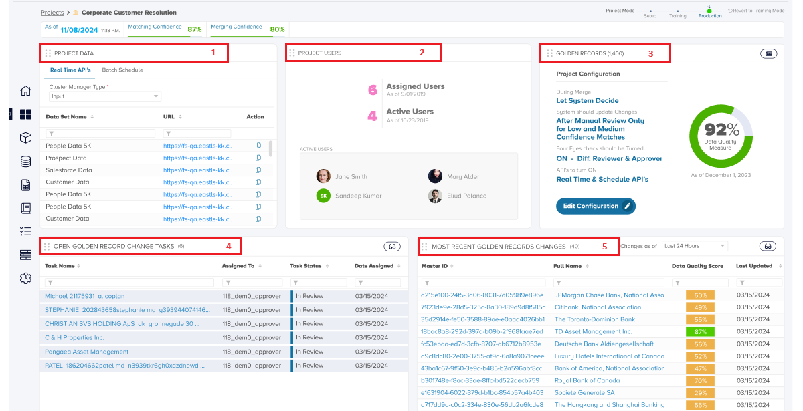
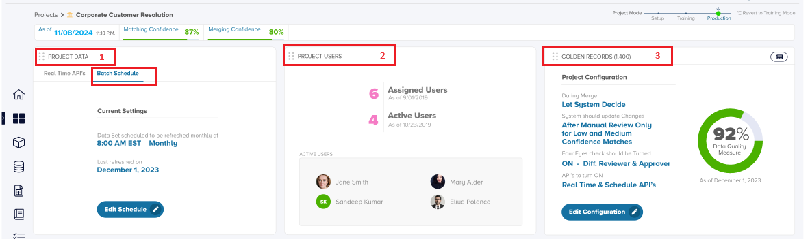
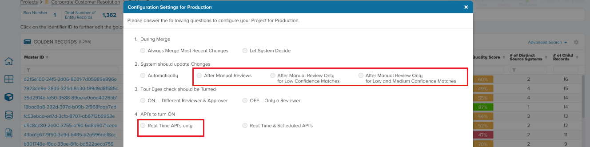
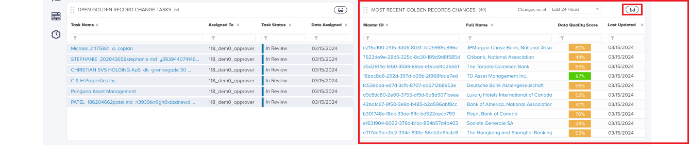

In this section, we'll cover the modified Project home screen and how the Golden record changes appear to the user , due to any real time or batch updates.

**Precondition**: The modified Project Home screen, as seen in the example image below, is available only when the project is in Production.

**Let us review the various sections of this screen**:

1. **Project Data** : This section is changed and will display two tabs - if you opted for both Real Time & Schedule updates during configuration. This shall display just the Real Time API information if Schedule API's are not opted for during configuration.

3. **Project Users**: This section is not changed and is the same as when the project was in training. As an Admin, you can still edit to add/remove or change entitlements of the Project.

5. **Golden Records**: This section has also changed and you will notice that the configuration options that were opted for are displayed here for any project user to view.

7. **Open Golden Record Change Tasks**: This is a different section which has replaced the earlier Match training section section available during Training. This will display the Golden Record Tasks if any have been generated.

9. **Most Recent Golden Record Changes**: As the long name suggests, this shows the most recent changes to golden records. These changes can be due to manual edit's or through delta updates in the Data Sources of the Project.

Let us understand these sections in detail.

**Project Data**

The project data section contains the information about the API's or Data Sources that are the source for all updates flowing in , into the project . This could be through various feeds. Depending on how the project was Promoted to production, the 'Batch Schedule' tab may or may not be there. For example, if the user chose to consider only Real Time API's during 'Promote to Production' , then the 'Batch Schedule' tab will not be present.

In case however it is present, the Batch schedule tab displays the last run details as well as the schedule configuration information such as time, schedule frequency etc. This can be seen in the image below.

**Project User**

The Project User section is the same as it was earlier without any changes. Users can be added or removed by a Project Admin and they will be considered for assignment. If a user is removed, the admin can manually re-assign any pending tasks on that user to another user.

**Golden Records**

The Golden Records section is changed as compared to it's previous look in a production dashboard. Here the user can see the Data Quality score as well as the information which was configured during promotion of the Project to Production in textual question - answer form. The project Admin can also Edit this information, but this has certain implications. We will take this up in a later section.

**Open Golden Records Change Task**

This panel or section sits next to the Golden record changes, on the left. As the name suggest it contains tasks which are not yet persisted as actual changes on the golden record. A Golden record change will appear here first (before moving to the 'Most Recent Golden Record Changes' panel when: 1) If the user had promoted the project to production specifying that changes be updated with some form of manual review and 2) a Golden record change happens: whether through a delta / update pipeline / feed or manually. In the image below , in configuration question # 2 , we can see the various options which provide for manual review. If 'Automatically' has been chosen as the option, **no** 'Golden record Change Tasks' will get generated.

We will discuss these tasks in a separate section in detail.

Only once these tasks are reviewed and reach the completion stage , they automatically disappear from this left panel of Home screen, and appear as new rows in the '_Most Recent Golden Record Changes_' panel on the right.

**Most Recent Golden Record Changes**

In production stage, the focus of the user may be to review / check on changes that are coming in - whether through real time / batch updates from pipeline OR from a manual edit of a Golden record by a user. Therefore, perhaps the most important panel in this Project Home screen is the : "_Most Recent Golden Record Changes_" . The changes showing here will come through either 'Automatically' or after 'Manual Review' as per the configuration options chosen when moving the project to Production.

In either case , such changes show up in this panel in the Project Home screen. The user can easily filter for changes happening in Last 24 hours, Last week, Last month or all of the changes.

Additionally the user can also press on the eye-glass icon to be taken to the main Golden record screen which we've already covered as part of Resolve projects. Here also, the user can filter for only those golden records which've changed in: Last 24 hours, Last week, Last month or All Changes.
