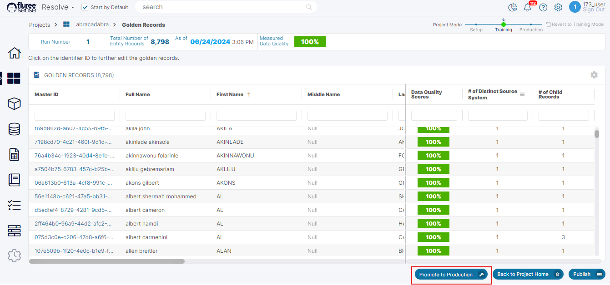
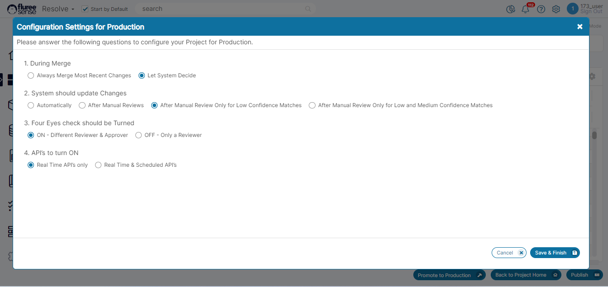
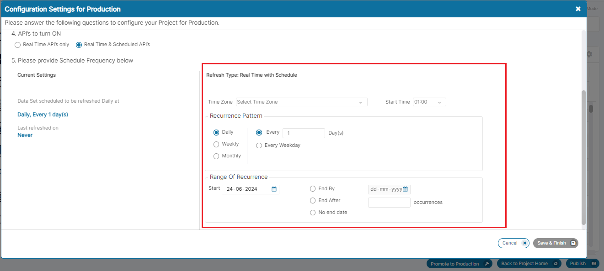

In the section on 'Resolution' or 'Resolve' , we had been talking about how to create the Project, how to Train it, how to Fix Issues and so on. However assume that a Project has generated Golden records and it's model has reached a level of confidence which is optimal according to your needs. At this stage the project has reached a certain level of stability and we may not want to generate training tasks all the time. Also, rather than using Training or initial set of Project Data, we may now want to receive Real Time or Batch changes or 'Delta' changes which the model would process and generate records.

To do all this, we need to promote the project to Production. 'Production' is basically a stage , like training wherein the Resolve project will:

1. No longer generate Training or Fixing Tasks

3. Be ready to receive Real-time or Batch changes from pipeline / api as per configuration and set-up

5. Process these individually and either generate 'Production' Tasks or process the changes directly.

7. Disallow changes in Data Sources etc.

So, to begin with, let us look at the Process of 'Promoting' a Resolve project to Production:

**Preconditions**: The project must be in 'Training' stage, must have Golden records generated in the most recent run **and** have no Training tasks pending (i.e. not 'Completed') .

**Who can move the Project to Production**: The logged-on user should have 'Admin' entitlements in the Project.

**Steps to Move a Resolve Project to Production**

1. **Click on the 'Promote to Production' button in the Golden Records listing screen** : This button is present in the footer and will be enabled only if the user has 'Admin' entitlements in the Project and above preconditions are met. This can be seen in the image above.

3. **Review the Configuration pop-up and start answering the questions** : Some configuration information is required for a project when moving it into Production. This is based on practical use-case that are seen for such projects. These questions include:
    - During Merge : - Always merge most recent changes OR Let System decide.
    
    - System should update Changes :- Automatically OR After Manual Review OR After Manual Review Only for Low Confidence Matches OR After Manual Review for Low and Medium Confidence Matches.
    
    - Four-Eyes check should be turned :- ON - Different Reviewer & Approver OR OFF - only a Reviewer
    
    - API's to turn ON :- Real time API's only OR Real time & Scheduled API's. All these can be seen in the image below: 

5. **Review & fill the Scheduling options in the Configuration pop-up** : If the user has selected the radio button to switch on both Real Time and Scheduled API's , it is logical that we have section to define the Scheduling options. SO, in this case, a new section is seen in the screen where the user can define the frequency , duration , timing of batch schedule.

7. **Save the Configuration and view the modified Project Home screen** : Once all the information is filled and user presses the 'Save & Finish' button. On pressing this button , the pop-up closes and the user is redirected to a modified Project home screen that has been described in another screen. This screen has information which is related to this 'Production' stage of the Project.

**System Validations**

1. All questions in the Configuration pop-up need to be completed for the 'Save & Finish' button to be enabled.

3. If the 'API's to turn ON' option is 'Real time API's Only' then once the configuration is saved and the pop-up closes showing the Project home, it will not have a Batch tabbed area

5. If the 'API's to turn ON' option is set to : 'Real Time & Scheduled API's then scheduling information will need to be provided and that has it's own set of validations. These include:
    - Providing Valid dates excluding back-dates for 'Start Date'
    
    - Providing a Time-zone and Start Time for scheduling
    
    - Providing either no. of occurrences or end date or choosing the 'No end date' option. The scheduler section can be seen below.

7. The Four eyes check will take and display the default value from what has been set-up last in the user edit screen , by Admin.
