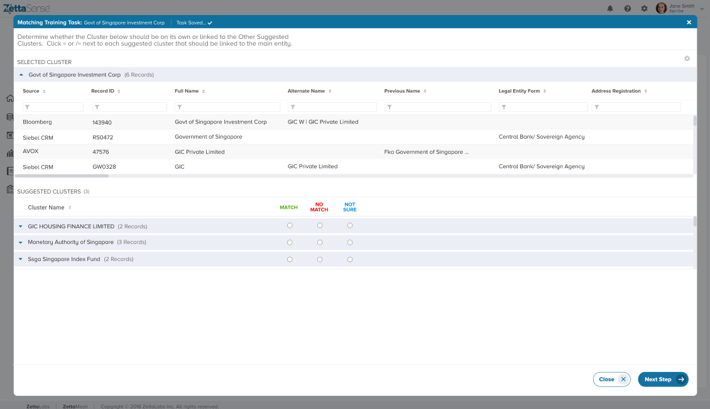
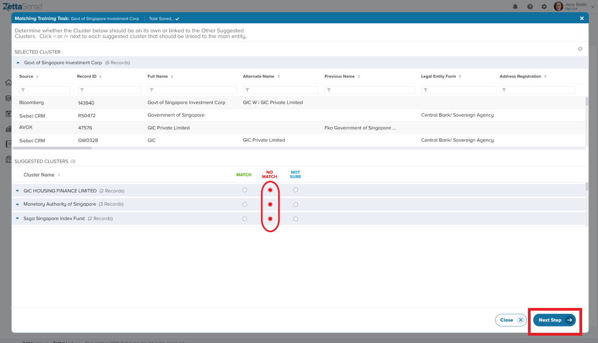
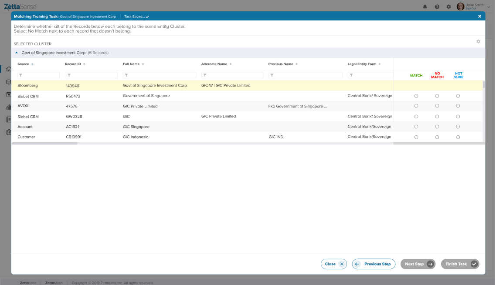
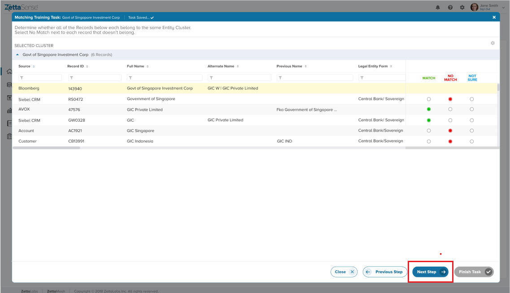
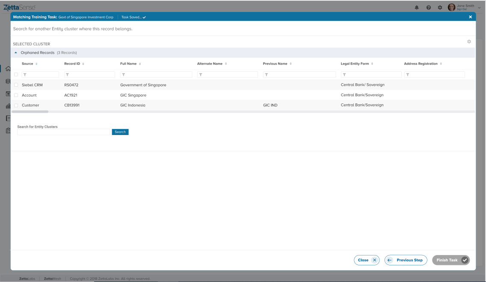
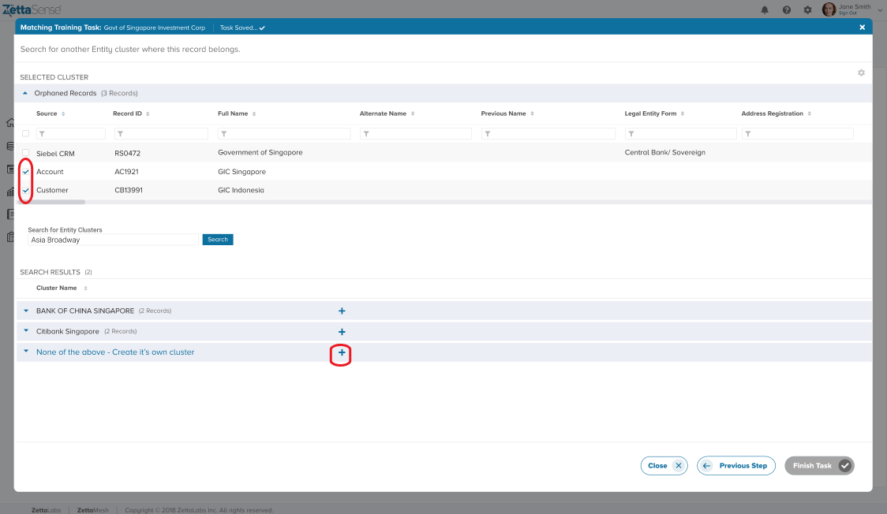
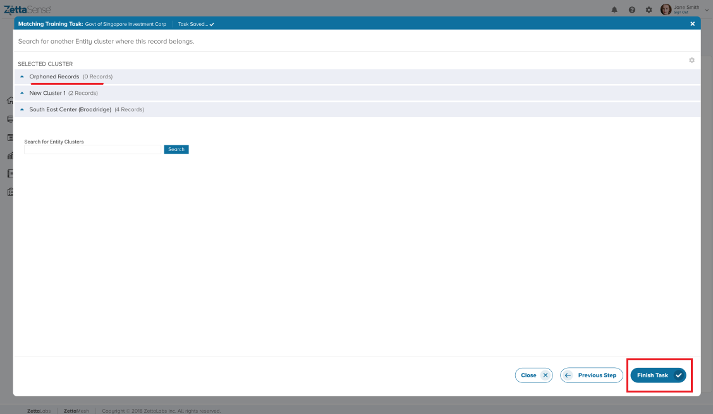
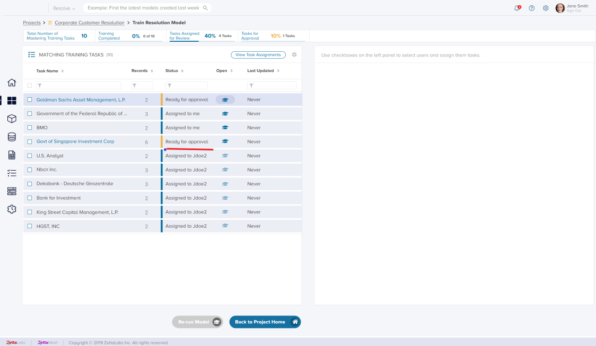

You can access Tasks from the Project Home screen by clicking the Train Model icon in the _Entities Resolved_ section of the Project Home Screen. Please check the Section on [Viewing Project Home Screen](/docs/sense/Resolve%20Module/Resolution%20Projects/Viewing%20Project%20Home%20Screen/) to understand how the Project Home screen looks and works.

Both the Project Admin OR the Project Reviewer/Approver can access the Train Model section.

Matching Tasks get generated after the first run of the Project and any subsequent run until it reaches the required Threshold, followed by the generation of Fixing Tasks.

The System will automatically assign Users to respective Tasks. Only the Project Administrator or the Reviewer assigned to the Task will have the entitlement to complete it. Other Project stakeholders (e.g., other Reviewers or Approvers) will only have read access to the Task.

To open a training task, click the "Open" icon next to each Task status or directly on the Task name to launch a pop-up window.

There are up to three steps in a Match Training (or fixing) Task:

**Step 1. Determine if separate entities or clusters should be matched together:**

The System will display the cluster selected, as well as a few potential matches. The objective is to determine whether any of the other suggested _Entities_ are the same as the selected entity, and if so, the user will have to tell the System that they should have been matched. This Step only appears if the model requires human feedback for the specific entity selected. If not, it may skip directly to Step 2.

Step 1 screen appears as below:

One can use the expansion button to the left of each _Entity’s_ name to expand the window and display records for each cluster. This will help in comparing more than one entity. Further, if you use the horizontal scroll bar to scroll across all the record attributes, the records across both the selected cluster and the other expanded suggested cluster will move in parallel for easy visual comparison between the records from each cluster.

Once users are ready, they can select either Match if the two clusters really represent the same Entity, or No Match if the two clusters do not represent the same _Entities._ The other option is to select 'Not Sure' if the user doesn't know enough to make the determination. Note that the system will only display the top few suggested clusters (typically 7) even if there are more.

Once the user makes the selection, click “Next Step” to proceed to Step 2.

**Step 2. Determine if all records in a cluster really belong together:**

In this step, the user will be asked to confirm whether the records are properly linked together by determining the match for the records.

If all the records belong together (i.e., they all Match), the task gets finished, and the "Finish Task" button is activated. However, if the user selects the ‘No Match’ radio button for any of the records, the "Next Step" button is activated, and we move to Step 3.

**Step 3. Match the orphaned record to a new Entity**:

In this final step, one can search for other entities and find where the record belongs or if it represents its own standalone _Entity_. All the records identified as No Match from Step 2 will be carried over to this step.

There will be a search field to enter the name or other unique property about the record and check for any other clusters that can be a better home for the record. Once you enter the keywords, the Search button activates, and any cluster that contains the keywords or close variants will appear below.

The top matching clusters from the search query are returned. You can use the expansion feature to expand or collapse each cluster to look at the records underneath each and compare them to the orphaned record at the top.

Once you have compared each result, you can link the record to any other clusters by hitting the + icon next to the cluster name. If none of the search results matches, try other keyword searches or select the final “None of the above” option to move the record to its own cluster.

Continue this step for other remaining Orphan Records, either creating or adding new clusters to existing ones. The system is flexible enough to allow users to move between these newly created clusters if the users change their minds about specific records during this project. So, as an example - if you've moved 2 records to a Cluster 'ABC' which has moved to the top part but realized that 1 record was incorrectly moved, you can again select that record, search for another cluster (or use 'New Cluster' option) and make the correction.

Once all Orphaned Records are linked to one or the other cluster, the "Finish Task" button is activated, denoting the completion of the task.

**Useful Note:** The user won't be able to save the Data until the whole process is completed. So, pressing the "Finish" button is a vital step to save the whole assortment of clusters. If you do not press 'Finish' you will lose the data in this 3rd step (unlike in the first 2 steps). This is because the system is proposing the records movement to these cluster based on your selection but that get's locked in only after the Project is run to account for the model's assessment of your choices.

Once the pop-up modal is closed, and the task is reflected on the Task List as moved on to the next stage (Approval is needed if the mandatory Four Eyes check option is activated; otherwise, it is marked as “Completed”). (Refer to the image below)

Once all the training tasks are in the "Completed" state, the "Re-run Model" button is activated. Only users with the Project Admin role can re-run the model to trigger the "Supervised Learning" model, which generalizes the feedback from various training cases into knowledge that the System further uses to improve its matching confidence.

The matching will be re-run, with progress steps displayed in the lower left-hand panel. The Entity count and compression ratio will be different based on the results. Using the graph on the lower left panel, one can monitor how the Matching confidence changes with each successive run.

**Auto-Save for Matching Tasks**

Auto-Save is a new feature for Matching Tasks (in Entities Resolved section) which is going live from _Release 2.3_ . As we have seen above, a Matching Task has a workflow which may span up to 3 steps / screens. The first to include similar clusters to the cluster being reviewed, the 2nd to review the individual elements of the cluster itself and the third being to allocated the unmatched elements of the cluster to other clusters. Auto Save works for the first and the 2nd step which essentially means that you may make your 'Match' , 'No Match' etc. choices without pressing the 'Finish' button and the same shall be available for you to complete even if you browse away from this screen or log-out. This is helpful if the user is not sure about particular record(s) in a cluster, wants to consult or come back to the task to complete later without losing their work. This applies to any user with the requisite rights on this screen.

Auto Save does not work as such for the third screen as allocating the 'Orphaned' records to new cluster will happen after the run of the project so they'll NOT appear in the user interface as auto-saved items to be worked on further. Therefore , please note that any changes made to the third screen should be completed and 'Finish' button pressed to save them for consideration in the next Project run, before exiting.
