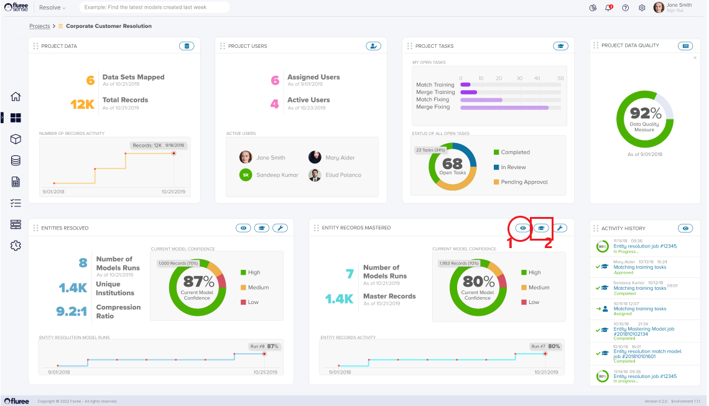
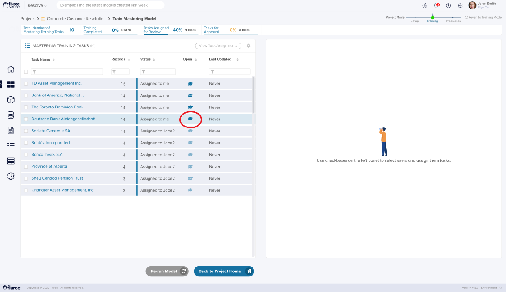
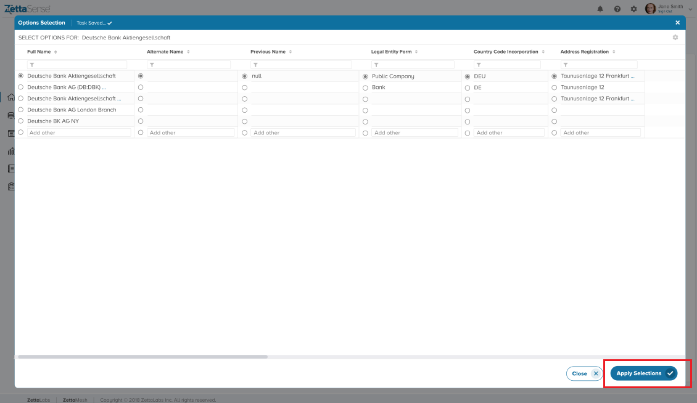
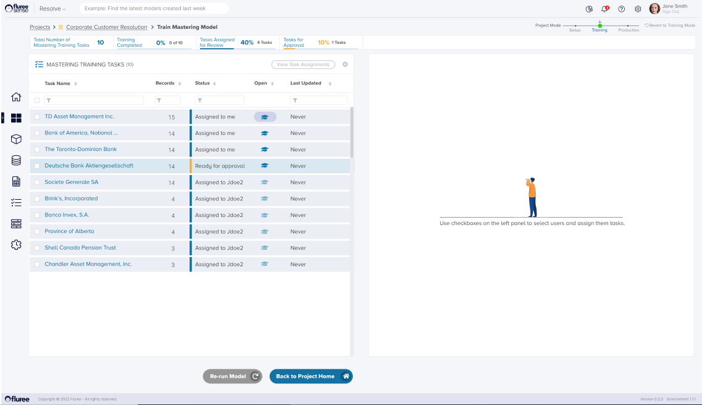

The Golden Record creation (i.e., “Merging”) model synthesizes the records within a cluster into a single record containing the best data from all records in the cluster. So, if there are three possible addresses from records from three different sources in a cluster, the “Merging” model will attempt to select the most likely accurate address out of the three.

  
Click on the "Train Model" icon (marked 2) on the lower right-hand bottom of the page to enter the "Mastering Training Tasks" screen. Like "Entity Resolution" training, the System will display the set of generated Training Tasks in the left-hand panel:

  
The System will automatically assign Users to respective Tasks. Only the Project Administrator or the Reviewer assigned to the Task will be entitled to complete the respective Task. Other Project stakeholders (e.g., other Reviewers or Approvers) will only have read access.

To open a training task, click the "Open" icon next to each Task status or click directly on the Task name to launch a pop-up window. There is only one Step in a "Merge Training" (or fixing) Task:

**Step 1. Determine if the selected values are the correct ones**:

The System will display all unique possible values from all records within the cluster for each attribute. At the top, one can find the value selected by the model. The user can choose any other values or write another option in the free-form text field provided. The user must click the "Apply Selections" button after completing all the choice selections.

  
The pop-up menu is closed, and the task is reflected on the Task List as moved to the next stage (Approval is needed if the mandatory Four Eyes check option is activated; otherwise, it is Completed).

  
The "Re-run Model" button will activate once all training tasks are marked as "Completed." Only users with the Project Admin role can re-run the model to trigger the Supervised Learning model further, generalizing the feedback from the various training cases into knowledge that the System uses to improve its merging confidence.

The merging will be re-run, with progress steps displayed in the lower right-hand panel. Based on the results, the overall confidence level for the "Golden Record" creation will be different. Using the graph on the lower right panel, one can monitor how the Merging confidence changes with each successive run.
