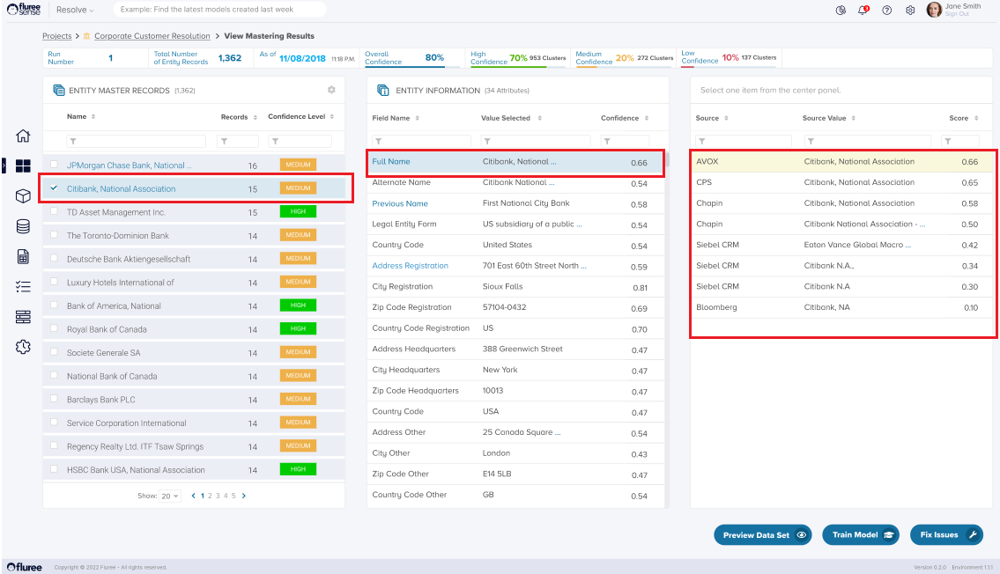

To view “_Entities Mastered_”, click on “_View Results_” icon (marked **1**) in the lower right panel:

This will bring up the **View Mastering Results** screen composed of three panels. The leftmost panel contains the list of resolved _Entities_ from the "_Entity Resolution_" process. If the user clicks on any entity name, the middle panel (Entity Information) populates with the "Golden Record" information, the attribute the model has chosen as the best value. Next to each attribute, the Confidence Score identifies how confident the model is that the selected value is the best.

If one clicks the name of each attribute, the third panel becomes populated, which contains the unique attribute value from each record in the cluster and the model score for that attribute. The highest scoring value is selected to go into the Golden Record.
