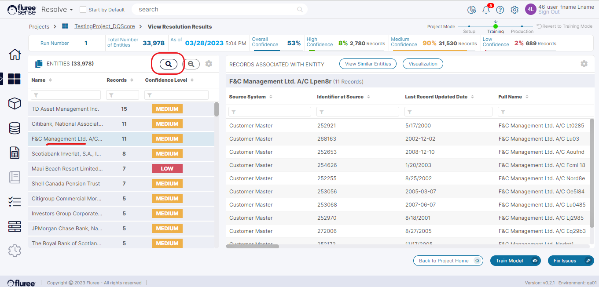

Now, let's look at the results of the "_Entity Resolution_" model. You can access the results by clicking the eyeglass or "View Results" icon in the "_Entities Resolved_" panel.

By default, you will see a list of unique Entities on the left-hand panel, along with the number of records that have been matched and clustered together for that entity and the Confidence level from the model for the accuracy of matching/clustering.

Clicking the name of any _Entity_ on the left-hand panel will show rows of the records matched together for that entity, appearing in the right panel. From here, one can scroll through and visually see all the records linked together. Alternatively, one can click "Train the Model" or manually "Fix Issues" buttons on the lower right.  
  
One can also do a deeper search by using the “Advanced Search” icon on top of the left panel, allowing you to find specific records clustered for a specific Dataset and/or of specific Confidence.

