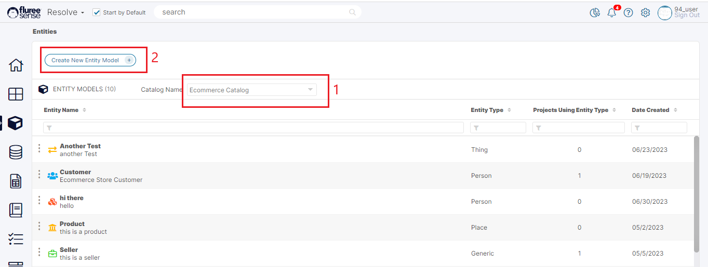
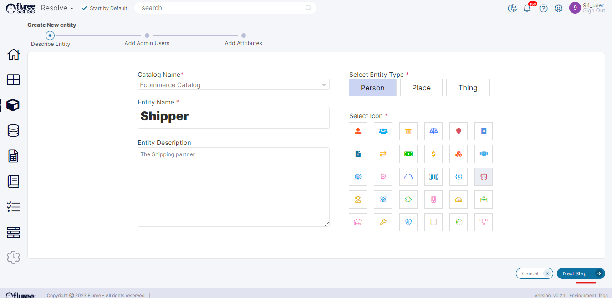
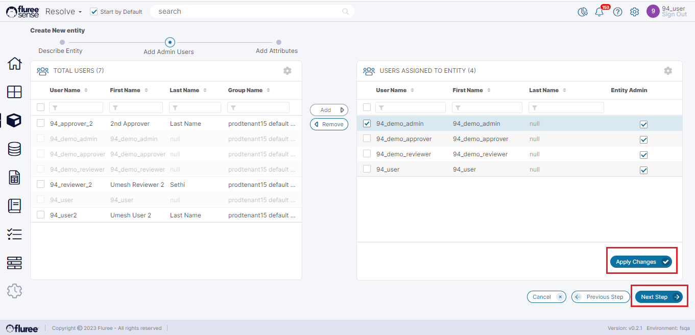

To create a new _Entity_, please follow the steps listed below:  
  
**Step 1. Choose The _Catalog_:**

Click on the _Entities_ icon from the left pane. Now, your license determines which _Catalog_ options will be shown to you. For a person who has purchased the license that gives the highest level of access, upon clicking the _Entities_ icon, the _Entities_ screen will open up, showing the _FlureeSense System Catalog_. You can change the _Catalog_ option here, which will be considered as the _Catalog_ for which you are creating the _Entity_.  
  
You can still change the _Catalog_ again in the next step.

  
  
**Useful Note:** Catalogs are a feature of the _Classify_ module. In case you are licensed to use just the Resolve product, the only Catalog available will be the Default Catalog for Resolve (which is initially empty and named Default Catalog). A user having the Classify module license will see - aside from the default empty Catalog - all Catalogs in the dropdown which are available to him or her in the Classify module.  
  
The ‘_Create New Entity Model_’ button will be disabled if you’re not a Catalog Admin for that Catalog. Therefore every user of the Tenant starts off as the Catalog Admin of the _Default Catalog._  
  
Click the button to move forward.

**Step 2. Add Basic Details of the Entity:**

In this screen, you can edit your choice of Catalog from the ones available in the list. The screen requires some simple things such as specifying _the Entity_ name and icon (this is mandatory) and optional entry of _Entity_ Description.

Click the Next button to move forward. Data from this screen is saved at this step.

**Step 3.  Add Entity Entitlements:**

In this screen, the person creating the _Entity_ is able to assign other _Entity Administrators_. The _Entity Administrator_ is the user who can edit the entity or its attributes and create Data Quality rules for that _Entity_.The user creating the _Entity_ is moved to the right panel by default as an _Entity Admin_, but the person(s) added by the _Entity_ creator can be replaced.

**Step 4.  Add Attributes for the Entity:**

This is the most important step, where the user can define the attributes of the _Entity_ and some key aspects as well. If you also have a _Classify License_, the first thing to note is that the _Entity_ is the same as a _Semantic Objec_t in _Classify_, and an Entity’s attribute is the same as the _Concept_.

Here we can add multiple attributes to the entity using the + sign. Along with the Entity name, certain other aspects are added/chosen, and these are explained below:

| **Field Name** | **Usage / System Validation** |
| --- | --- |
| Attribute Id | Integer Id, which is the local Id of that Attribute |
| Priority | This defines the order in which that Attribute will appear in various sections such as Golden Record Details, View Results etc.  The ones on top appear first. You can use the Red arrow to do Move Down and the Green to Move up. |
| Logical Name | The name which has been accorded manually |
| Physical Name | The name is provided by the system to keep the name unique, and the database consults to locate or identify a piece of data. |
| Description | Free Text Description of the Field |
| Data Type | Select what Data type the field supports – it can be one of String, Integer, DateTime etc. |
| Scrubber Type | Scrubs data with Machine Learning Logic for that type of data - for example, an individual’s name etc. |
| Match Type | Dropdown with various values like Strong Identifiers, Entity Identifiers, Strong Descriptors etc. At-least one Entity Identifier is required to save the Entity. |
| Reference Data | Assigning reference data to an attribute automatically adds data quality rules based on the pattern that the system finds in the reference data. |

**System Validations**

1. Edit _Entity_ Mode button toggles to “Return to View Only”. The edit _Entity_ Mode button is only enabled for users with _Entity Admin_ rights for that entity.

3. In Edit mode, the user can also add a Reference Data Set to that attribute. If a Reference Data Set is already added, it’ll show that as a different icon when the screen is in edit mode, whereas if no Reference Data Set is present, a plus symbol will appear.

5. Entering all details of the attribute, including the Logical name, Physical name, Data Type etc., is mandatory for it to be added.

7. Duplication of Entity Attribute's Logical or Physical Name is not allowed. The user will be shown an error message on duplication and will need to correct the attribute

9. User shall need to press Save button in the footer to commit the changes and run a configuration process although the attributes do get saved on individual row saves Or on Import etc.

11. Each time the entity is Save & Configured after all the changes, the System checks that there are 2 attributes at the minimum of which one is a Attribute of Match Type = Entity Identifier
