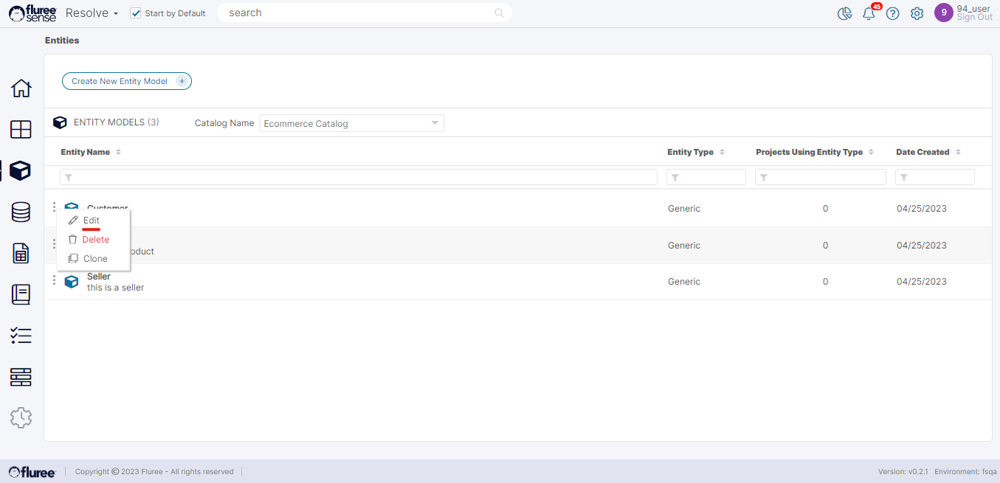
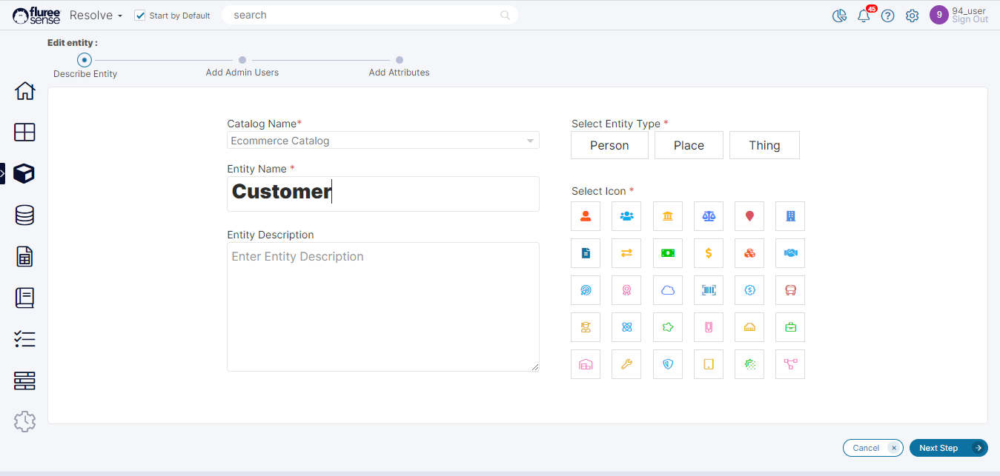
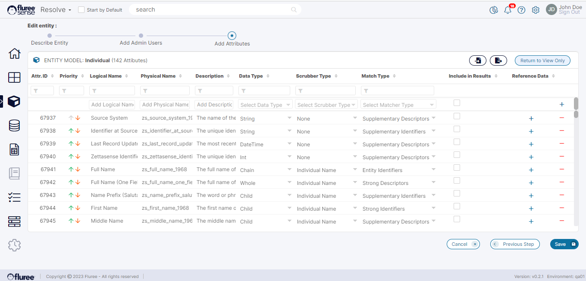
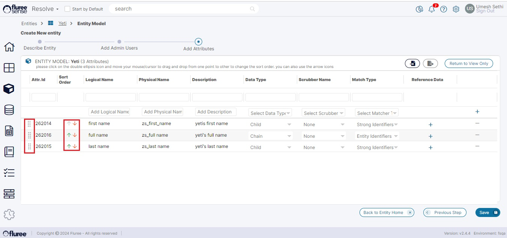

As discussed in the previous section, only a user having the _Entity Admin_ role for that specific _Entity_ can edit it. Otherwise, the related buttons / UI elements will remain disabled. The _Entity Admin_ can edit the _Entity’s_ name, add or remove _Entity Entitlements_, _Entity Attributes etc._

To edit an existing _Entity,_ please follow the steps listed below:

**Step 1. Open the Entity in Edit Mode**:

**Step 2. Edit the Entity Basic Details / Entitlements / Attributes:**

When editing the _Entity_, you can edit one or all aspects of it. So we’ve just taken this as a single Step. The editing of an _Entity_ is very similar to creating it. Look at the screenshot below.

You can follow the workflow as shown above till the beginning of the third step. Once you reach the third step (by clicking the ‘Next Step’ button), you will be in the ‘Add Attributes’ tab. Initially, the screen loads displaying the attributes. On the upper right-hand side of the screen, you will see a button labeled ‘Edit Entity Mode’. Clicking on it will refresh the system and you will now be able to see the attributes in edit mode. You can edit the attributes and click the ‘Save’ button when done. While you are in the edit mode, you will see that the upper button on the screen has toggled to ‘Return To View Only’. Clicking this button will take you to the initial view-only _Entity Attributes_ screen.

**System Validations**

1. The same Validations as in the [Create Entity flow](https://sensedocsdev.wpengine.com/creating-an-entity/) for this workflow step also apply during Edit Entity flow.

**Changing the Sort Order of Attributes**

Apart from Editing the Entity Attributes' in accordance with the validations, you can also change the sort order of the Attributes. This sort order is important because this determines the order in which the the attributes appear in various screens from left to right or top to bottom - such as Golden records , Lineage etc.

To move the attributes up or down, we always had the arrow keys (green to move up, red to move down) . However, if moving across multiple rows, this becomes cumbersome. In this situation you can use the drag and drop option by selecting the double ellipse in the left corner of that row and moving across. Please note it may take up to a second or so, for the result to reflect on the screen in case of large record sets. This drag and drop option is available for Entity Attributes in both Create and Edit flow and shall be available with the 2.4.4 release.

