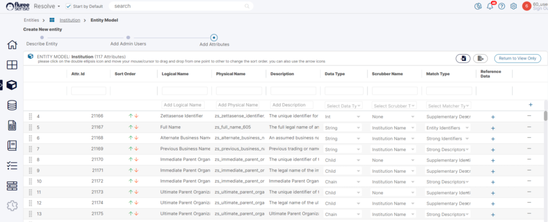
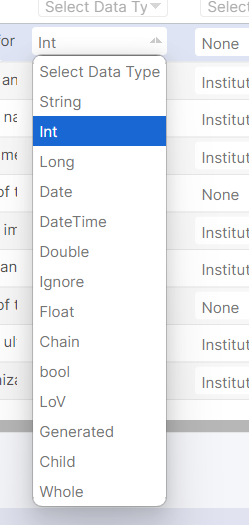
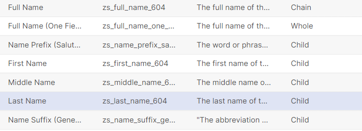
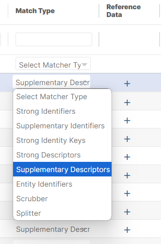

We already know that Fluree Sense's Resolve is centered around getting that grounded source of truth 'Golden Records' . These are generated for a specific Entity and each entity may have tens' or even hundreds of attributes. Here is a set of walkthrough videos for a quick refresher on resolve, but before you start using resolve, it is very important to understand how these Entity Attributes impact a Resolve project. After going through this article you should be able to apply best practices and refined knowledge to make the best use of your Entity set-up in Fluree Sense resolve.

When creating an entity the user will add individual properties or concepts to the entity called **attributes**. (In Classify, these will appear as Concepts instead of attributes, but they are equivalent). Each entity attribute will contain the following things:

1. **Attribute Id** - Auto-generated Integer Id, which is the local Id of that Attribute

3. **Priority** - This defines the sort order in which that Attribute will appear in various sections such as Golden Record Details, View Results etc.  The ones on top appear first. You can use the Red arrow to do Move Down and the Green to Move up.

5. **Logical Name** - The display name for an attribute that is easily readable by a User.  This name may include spaces or special characters, which would otherwise be difficult for machines or systems to interpret properly.

7. **Physical Name** - The technical name provided by the system to ensure that the name is unique and readable by machines or application processes.  The physical name is what will appear when the final Golden Records are exported to a physical database table.

9. **Description** - Free Text Description of the Field which helps understand what the attribute is about. Although optional, it is always a good idea to fill this.

11. **Data Type** - Select what Data type the field supports – it can be one of String, _Integer, DateTime, Float_ etc.  It can also be used to describe if one attribute is partially embedded or connected to another attribute.  We will describe this unique data type property in the section about _Child, Whole, Chain_ attributes.

13. **Scrubber Type** - A reference to a process that will stem, clean, normalize values and remove any stop words.  The scrubbed version of the data is what will be used in Machine Learning processes for that data.  We will describe the various different types of scrubbers below, but for example, Individual Name scrubbers look to normalize common forms of names (e.g., Edward, Eddie, Ed).

15. **Match Type** - Selectable dropdown list that describes how an attribute can be used in Matching Logic.  There will be various values like Strong Identifiers, Entity Identifiers, Strong Descriptors etc. We will explain these further below, and how selection of the Match Type for an attribute helps prime the Machine Learning models to start with some semantic reasoning.  One of the attributes must be selected as the Entity Identifier in order to save the Entity.

17. **Reference Data** - Assigning reference data to an attribute automatically adds data quality validation logic, to see if a value is in the Reference Data list or not.  Assignment of Reference Data requires selecting the data set and column that contains the valid value list for that attribute.

An example of an entity and it's many attributes can be seen in the image below:

We will further provide details on three important attribute properties below:

1. Data Type

3. Scrubber Type

5. Match Type

**1\.** **Selecting an Attribute’s Data Type**: The List of choices available can be seen in the image below. It's important to choose the right data type and ensure that the Data Type is spelt correctly and considered case sensitive when adding through Import file.

      

A data type of an attribute can be used to identify 2 main things.

1. What Data type the field supports (e.g., string, boolean, dateTime).

3. If that attribute has a relationship with any other attributes.

**Special Data Types**

If the user selects Child, Whole, Chain from the dropdown menu they are specifying that the attribute has a relationship with another attribute. Let’s look at an example of such related attributes (or concepts).

In some systems, the name of a person could be in one field such as “Full Name.”  In other systems, the name could be split into multiple fields, such as “First Name”, “Middle Name”, “Last Name”, etc.  In order to compare records, the system must be able to compare terms accurately between systems; comparing the Full Name in one system to just a First Name from another would not be correct.

In Resolve, you can define each of the different concepts as a different property:

- A parent attribute (or what we call a Chained Attribute) that represents the concatenation of two or more concepts.  So, in the example above, we create a Full Name Chain attribute, and assign it a Data Type of Chained.

- A child attribute which will be linked to the parent.  For example, First Name, Middle Name, Last Name could all be assigned to a Data Type of Child.

- One attribute for the whole name representation, so Full Name can be assigned to the Whole Data Type.

The reason that we split it up this way is so that later we can correctly map individual columns from the source systems to their corresponding attributes.  In one data set, we can map a column containing the First Name to the First Name Child Attribute in the entity model.  In a different data set, a column that contains the whole name can be mapped to the Full Name Whole Attribute.  (We never map to a Chained Attribute; the system will automatically concatenate Child Attributes into a Chain Attribute value for that record and compare the Whole Attribute from one source to the Chain Attribute in another source).   
Here is an actual example of how the attributes are represented in the out-of-the-box Individual Entity Model:

**2\. Selecting an Attribute’s Scrubber Type**: Next we will discuss the importance of an attribute’s **_Scrubber Type_.**

Scrubbers are used to normalize and stem data values which may be use different terms to describe the same thing.  There are four types of Scrubbers in Resolve:

- Individual Name:  This is used to normalize different variations of person first names.  For example, Henry and Hank or Beth and Elizabeth may be different variations of the same name in the United States.  Or Jan and Jonathan could be the same first name from systems from multiple countries.  The Individual Name scrubber can be used to create a normalized form of the name that can be used to compare people from multiple sources.

- Institution Name:  This used to normalize different variations of company names, particular for legal entity forms.  For example, Acme Inc. and Acme Incorporated may be the same company.  The Institution Name scrubber splits out legal form information from the name, and then normalized legal entity forms, so that you can independently assess whether either the name or legal entity form of a company are a match.

- Address:  This is used to normalize variations in Address Names, such as Street and St. or Florida and FL.

- Date:  This is used to normalize date forms into a common YYYY-MM-DD form for comparison.

**3.** **Selecting an Attribute’s Matcher Type**: Lastly we will look in depth at an attributes matcher type.

Lastly we will look in depth at an attributes matcher type.  A Matcher Type is a way of prompting the entity resolution models to understand how alike things need to be in order for them to be considered a match, and how important that fact that they are alike (or not alike) is to the determination as to whether they are the same entity or not.

At a high level, there are three core ideas to understand in setting an Attribute’s Match Type:

- Identity Key vs. Identifier vs. Descriptor:  This is a way to tell the model how close an item needs to be in order for something to be matched.  An Identity Key implies that two values of the same attribute must be a near identical match in order for the two values to be considered alike.  An Identifier implies that the two values must be a very close fuzzy match in order to be considered alike.  And a Descriptor means that two values could be a loose fuzzy match and still be considered alike.  What those terms actually mean (near identical, close fuzzy or loose fuzzy) will ultimately be determined by the model, but this is a way to point the model in the right direction.

- Strong vs. Supplementary:  This is a way to tell the model how important an item is in the decision to link two entities together.  If an attribute is Strong, this means that when they are alike, there is a high probability that the entity is the same and when they are not alike, there is a high probability that the entity is not the same.  If an attribute is Supplementary, this means that when they are alike it may not mean that they are the same entity – but it is a clue.  And when they are different it doesn’t necessarily mean that they are not the same entity, but it is a clue.

- Splitter:  This is a way to tell the model that two things must match or else they are definitely not the same entity.  For example, a Suffix is a good example of a Splitting attribute.  If we see two records where one has a Suffix of “Junior” and the other has a Suffix of “Senior”, then there is a very strong likelihood that the records are describing separate entities.

The three ideas above are combined into a full set of Matcher Type values, displayed below:

Below is a description of each Matcher Type and how they are used by the entity resolution model:

|   Match Type   |   Description   |   Examples   |   Match Degree of Similarity Required   |   Boost If Match   |   Penalty If No Match   |
| --- | --- | --- | --- | --- | --- |
|   Entity Identifier   |   This is the single most important attribute in the entity model. This attribute will be the anchor attribute that will be used to identify and describe the clusters for the entity. One or more attributes can be tagged as the Entity Identifier and the entity identifier will be a concat version of those attributes. Each entity must have at least one entity Identifier.   |   Full Name for a person, Last Name for a household, or Company Name for an institution   |   Strong Fuzzy Match   |   High   |   High   |
|   Strong Identity Keys   |   A specific code or identification key that can be used to uniquely identify an entity.  These are attributes with highest importance and highest threshold for matching.   |   SSN, passport ID, Tax ID, National Drug Code, Drug Identification Code   |   Near Perfect Match   |   High   |   High   |
|   Strong Identifiers   |   A label or property that is part of the entity’s identity that when matched is a strong hint that the entities are the same. These are attributes with high importance and High threshold for matching.   |   First Names, Last Names, alternate names, date of birth, gender, product descriptions   |   Strong Fuzzy Match   |   High   |   Medium   |
|   Supplementary Identifiers   |   A label or property that is part of the entity’s identity that when matched is a clue that entities could be the same, but not in isolation. These are attributes with less importance and high threshold for matching.   |   addresses, phone numbers, weights, measures   |   Strong Fuzzy Match   |   Medium   |   n/a   |
|   Strong Descriptors   |   An additional property that may not be central to the entity’s identity that when matched could be a clue that the entities are the same.  These are attributes with less importance and high threshold for matching.   |   race, email, product family   |   Fuzzy Match   |   Medium   |   Medium   |
|   Supplementary Descriptors   |   An additional property that may not be central to the entity’s identity that when matched is a clue that entities could be the same, but not in isolation.  By themselves, these are the least important attributes in matching.   |   industry codes, weights, measures, pack type   |   Fuzzy Match   |   Low   |   n/a   |
|   Automatic Splitters   |   A property that is used to define that entities are NOT the same when the values are not alike   |   Boolean flags, Manufacturer Codes, Suffixes   |   Near Perfect Match   |   n/a   |   High   |
