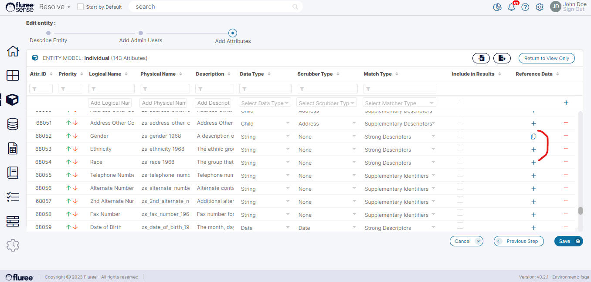
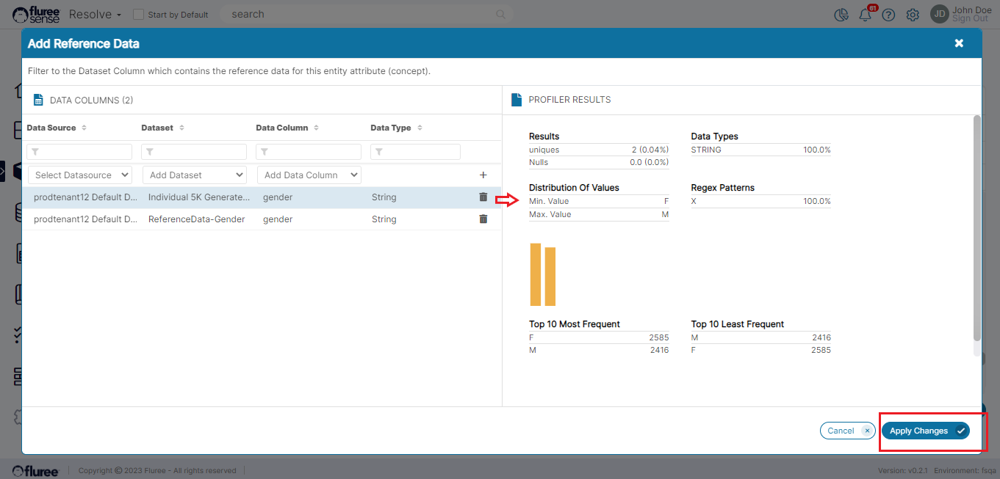

In the sections that talked about creating and editing and an Entity, we saw how the _Entity_ Attributes could be created/edited. When the _Entity_ is in edit mode, the user can also link Reference Data to an _Entity’s_ attribute by linking a Dataset Column to the _Entity_ Attribute. This is shown in the image below. Attributes with pre-existing Reference Data show the copy icon in the column, and on opening up, they also show the linked Reference Data.

To add or Edit Reference Data to an _Entity’s_ Attribute, please follow the steps below:

**Step 1. Open the Reference Data Popup:**

When the _Entity_ screen is opened in the edit mode, you can see the + icon under the Reference Data column. Simply click on the + icon to Add New Reference Data Set linkage or click the document icon (which indicates there are already linked Data Set(s)). In the latter case, you can edit and replace those Data Sets.

**Step 2. Add new or Edit Existing Data Sets in Popup:**

Using the drop-down, select the Data Source, then Data Set, and finally the Data Column. You can select more than one and check the summary of the Data Statistics, which is termed as the Profiler Results on the right panel. Once done, you can click the Apply Changes button to Save. This will redirect you back to the _Entity_ Detail screen.

**Useful Note:** Assigning a Reference Data relationship to an _Entity_ Attribute automatically creates an _Out of the Box Data Quality Rule_ (or OOB rule) in the System, which checks and flags rows where this condition is violated. This rule is run every time any Resolve Project linked to that Entity is run.

This benefits the user by automatically integrating a data quality and refinement aspect to their data.
